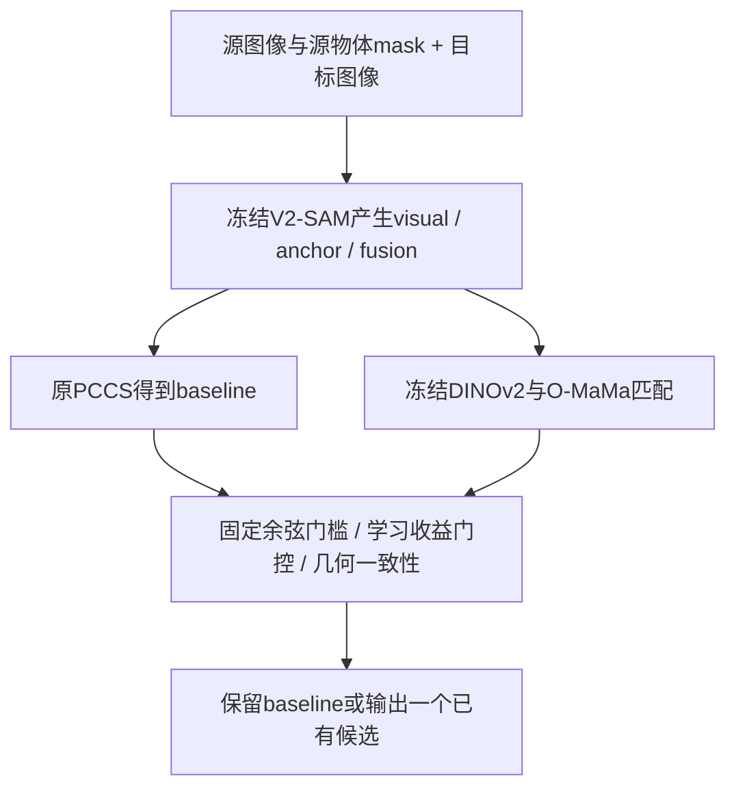

# V2-SAM PCCS／O-MaMa 实验总报告

> 唯一总报告；具体运行文件在各实验目录。更新到已取回并验证的机读结果，未完成项目保持待定。研究主目标为 **Exo→Exo 稳定增益**，Exo→Ego 用于验证源方向与比较迁移。

## 1. 当前结论与完整结果

- 指标与pipeline已按实验日记和`v2sam-pccs@0e3bc33`复核：新frame-level口径正确，零IoU保留，未发现历史DINO二次初始化或目标GT内容影响推理的问题；证据与边界见§5。
- 作者权重与用户修复版权重必须分列。每个delta只减**同一轮、同权重、同候选bank**的PCCS基线。
- 修复版权重Exo→Exo的预先指定主方案native-margin已获得正的95%序列bootstrap区间；几何一致方案点估计更高，但它是次要对照，未证明显著优于其他改进方法。
- “稳定”在这里指当前基准上主比较的统计证据，不是保证每个对象、每个随机种子或所有新场景都涨点。

### 1.1 全量 frame-level 指标

IoU／Dice／ContA 为百分数，LocE 为原始归一化距离（越低越好）。置信区间对应 **IoU 增益，单位百分点**。

#### Exo→Ego／作者权重

范围：46,515 对、109,253 对象、295 个拍摄序列。

| 方法 | IoU | Dice | ContA | LocE ↓ | ΔIoU | 95% 序列区间 |
|---|---:|---:|---:|---:|---:|---|
| PCCS 基线 | 53.6119 | 58.4215 | 61.2772 | 0.079557 | +0.0000 | — |
| 学习判断器（0.03） | 57.2772 | 62.5996 | 65.4734 | 0.063225 | +3.6653 | [2.6849, 4.8846] |
| 原几何 O-MaMa（0.05） | 56.3418 | 62.0700 | 64.8422 | 0.062119 | +2.7299 | [1.8716, 3.7992] |

完整机读结果：[results.json](runs/full/results.json)。

#### Exo→Exo／作者权重

范围：1,094 对、1,094 对象、20 个拍摄序列。

| 方法 | IoU | Dice | ContA | LocE ↓ | ΔIoU | 95% 序列区间 |
|---|---:|---:|---:|---:|---:|---|
| PCCS 基线 | 38.4343 | 43.0601 | 49.3730 | 0.111046 | +0.0000 | — |
| 学习判断器（0.03） | 39.8194 | 44.4688 | 50.7842 | 0.112305 | +1.3851 | [-0.0288, 2.7435] |
| 原几何 O-MaMa（0.05） | 40.0936 | 45.1509 | 51.7500 | 0.110549 | +1.6593 | [-0.4837, 3.6114] |

完整机读结果：[results.json](../pccs_exoexo_transfer_20260916/runs/full/results.json)。

#### Exo→Exo／修复版权重

范围：1,094 对、1,094 对象、20 个拍摄序列。

| 方法 | IoU | Dice | ContA | LocE ↓ | ΔIoU | 95% 序列区间 |
|---|---:|---:|---:|---:|---:|---|
| PCCS 基线 | 38.5257 | 43.0423 | 49.8778 | 0.107579 | +0.0000 | — |
| 学习判断器（0.03） | 41.1004 | 45.8611 | 51.7460 | 0.113841 | +2.5747 | [0.2836, 4.4629] |
| 原几何 O-MaMa（0.05） | 42.3595 | 47.3987 | 54.0980 | 0.102981 | +3.8338 | [1.3203, 5.9842] |
| 保持纵横比 O-MaMa（0.05） | 42.2665 | 47.3906 | 54.5521 | 0.102878 | +3.7409 | [1.5792, 5.7901] |
| 两几何一致才替换 | 42.5829 | 47.6861 | 54.8069 | 0.098797 | +4.0572 | [2.1297, 5.8095] |

主比较为**保持纵横比 O-MaMa**；其他区间是未作多重比较校正的探索性结果。旧学习判断器在作者权重候选上训练，本轮只是冻结迁移对照；它的LocE并未改善。

完整机读结果：[results.json](../pccs_corrected_exoexo_20260916/runs/full/results.json)。

#### Exo→Ego／修复版权重

**待完成：46,515 对、109,253 对象、295 个拍摄序列。** 使用corrected Visual e19／Fusion e20，先32对四卡预检，再全量候选生成、五方案打分与汇总。主比较提前指定为几何一致性；门槛不变、不重新拟合。结果尚未回填，不能使用其他行的分数代替。

### 1.2 Object-level 与独立确认

Exo→Exo当前每pair恰有一个对象，object和frame指标相同；Exo→Ego的对象数不均，两套聚合不能混写。

| Exo→Ego 权重 | 方法 | Object IoU | Object Dice | Object ContA | Object LocE ↓ |
|---|---|---:|---:|---:|---:|
| 作者权重 | PCCS 基线 | 48.7024 | 53.5566 | 56.8509 | 0.083398 |
| 作者权重 | 学习判断器（0.03） | 52.6130 | 58.0675 | 61.3366 | 0.065611 |
| 作者权重 | 原几何 O-MaMa（0.05） | 51.6822 | 57.5595 | 60.7291 | 0.065190 |

独立确认：作者权重下的512对／965对象／64序列holdout，PCCS **70.9472→74.9235**（学习判断器，+3.9762点，95%区间[2.5743,5.4232]）。这些序列排除了此前探索与第一批确认序列。后续全量包含历史已观察测试样本，因此全量是冻结方案的基准评测，不是整个测试集从未观察过的盲测。

## 2. 数据、权重和统计口径

### 2.1 任务方向与权重身份

Exo→Exo的源和目标都是外部相机视角；没有专用权重时借用Exo→Ego权重，**任务标签仍是Exo→Exo**。Ego→Exo的新判断器尚未评测；该方向PCCS可能选组合／阈值mask，需要先适配当前三专家身份特征，不能只改启动方向。

| 资产 | 来源／用途 | SHA256 或版本 |
|---|---|---|
| corrected Visual | 用户重训e19，926,619,220 bytes | `fd2e1b8f342c4468b45c962c61d4c914b9f6d71b6c6085014fb9a3ed2924b65f` |
| corrected Fusion | 用户重训e20，2,136,421,714 bytes | `8373b17180c198898fe9f9e39d09fe72991150ce3053b207b19e81986c60cab1` |
| 发布仓库 | `Travor278/V2-SAM`，两文件与平台逐字节一致 | `8b8310e9ee13023cb8711c2417e18cc7361dc3aa` |
| 原作者Visual／Fusion | 历史对照，来自`official_weights_wangzeze` | 分别以`55761ff4…`／`a4a09371…`开头，完整值在审计回执 |
| 冻结学习判断器 | 作者权重候选上训练的HGBoost | `f79543baa14e81ebc83fa3bb7458e0940e405afe31a556fb612281c6aa0d2678` |
| O-MaMa代码 | 公开Exo→Ego预训练匹配头；本轮冻结 | `0f187c65cb9d8f8df1d8b5f445edbb0485956d88` |
| DINOv2代码 | ViT-B/14-reg4，新增打分分支 | `7764ea0f912e53c92e82eb78a2a1631e92725fc8` |

修复权重的远端文件位于`codex_remote_ops/hf_publish_exo2ego_20260903/tmp/`。原始SAM2/DINOv3继续用于V2-SAM候选生成，新增DINOv2/O-MaMa负责候选匹配，不应混称为同一个骨干。

### 2.2 指标和可比性

```text
object-level = 所有对象指标的等权平均
frame-level  = mean_pair(mean_object_in_that_pair(metric))
```

零IoU对象保留。ContA是上游边界F-measure；LocE是最大外轮廓点坐标均值之间的距离除以图像对角线，并非mask面积质心距离。目标标注按上游nearest缩放为1024×1024，与预测对齐。置信区间使用10,000次按拍摄序列重采样，序列长度不等时保留frame的sum/count权重，不能改成每序列均值等权。

“全量”的范围：Exo→Ego为46,515对／109,253对象／295序列；Exo→Exo为已构建基准的1,094对／20序列，不是Ego-Exo4D所有可能外部相机组合。前者图像对约为后者42倍、对象数约100倍，所以四卡运行约6小时和约11分钟并不矛盾。

## 3. 方法原理与实际实现

### 3.1 从候选生成到最终输出



Exo→Ego原PCCS为fusion-first：fusion通过面积／连通分量质量检查时优先采用，否则按源mask和循环对应信息回退到visual或anchor。所有方法先保留这个真实baseline，再按`baseline, visual, anchor, fusion`顺序去重相同二值mask；空替代候选不参与比较，空源提示保留baseline。新增选择模块不会修改mask边界，也不能在所有候选都错误时生成正确分割。

候选只生成一次，按rank分别保存无损bit-packed缓存。上游RegionSampler仍使用随机抽点，所以跨GPU／跨分片重跑不保证逐位相同；同一次方法比较的mask内容则严格一致。

### 3.2 O-MaMa怎样提取物体和上下文

使用768维DINOv2 patch特征，双线性插值到输入约1/4网格（patch14网格约放大3.5倍，尺寸按源码取整）。mask最近邻对齐。

```text
o(M) = mean{F(p): p在物体mask内}                       # 768维
c(M) = mean{F(p): p在bbox每边扩张100px的矩形内}          # 768维
d(M) = [o(M), c(M)]                                    # 1536维
```

100px位于预处理图像坐标中，越界裁剪。框内包含物体自身和背景，**不是减去前景后的环，也不是1.5／2倍面积缩放**。源物体和每个目标候选分别取框。当前不显式检测邻居物体，也没有实例关系图。bbox宽高、整数取整和边界裁剪跟随原代码。

### 3.3 双向交叉注意力和匹配分数

```text
a_q  = CrossAttention(o_q,  target整图tokens + P_t)
a_tk = CrossAttention(o_tk, source整图tokens + P_q)
z_q  = normalize(MLP([a_q,  o_q,  c_q]))
z_tk = normalize(MLP([a_tk, o_tk, c_tk]))
s(k) = cosine(z_q, z_tk)
```

共享MLP把2304维投影为768维；注意力从另一张整图取信息，局部框描述符单独输入MLP。所有参数来自公开预训练头并冻结。当前不使用其可见性分支，也未复现原O-MaMa的整套候选生成和训练流程。

四种用于判断器的分数：完整预训练匹配；将局部context和cross输入置零、仍用原MLP的物体主导匹配；DINOv2物体余弦；拼接`[object,context]`后的余弦。最后一项不是两个余弦的简单平均。置零只是推理干预，不是独立训练的object-only消融。

### 3.4 几何与固定门槛

- **canonical**：Exo→Ego源高532×宽952、目标700×700，对应38×68和50×50学习位置表；图像／mask按适配器固定nearest缩放，图像作ImageNet标准化。迁移到Exo→Exo时这会一同迁移ego目标的方形先验。
- **native**：保留每张图纵横比，最长边≤1024、向下取14倍数，对学习位置表作双线性插值；其余匹配参数不变。
- **固定门槛**：非空候选中取最高完整匹配分数，原始余弦比baseline高**超过0.05**才替换；baseline为空时选可用候选。0.05不是sigmoid概率差。
- **几何一致性**：canonical和native分别执行上述规则，只有二者选中同一候选才替换，否则保留PCCS。它不新增训练，但增加两路匹配计算。

### 3.5 学习判断器：预测相对baseline的IoU增益

其目的不是把语义相似度当成分割IoU，而是识别“更像物体、但边界可能更差”的替换风险。每个候选构造65项原始输入：

| 组别 | 内容 | 数量 |
|---|---|---:|
| 专家身份 | 候选与baseline分别对visual/anchor/fusion one-hot | 6 |
| 匹配分数 | 四种分数各取候选值、baseline值、差值、相对其他候选最高分的margin | 16 |
| 全局信息 | 源mask面积比、连通数、pair物体数、DINO前向置信度、三组候选间IoU | 7 |
| 局部质量 | 12属性各取候选值、baseline值、差值 | 36 |

12属性为：面积比、连通数、SAM预测IoU、SAM IoU margin、SAM object logit、循环距离、DINO反向置信度、前向点落入mask的比例，以及概率图的前景均值、`mean(2|p−0.5|)`、`p>0.55`与`p>0.45`的稳定IoU、`0.4<p<0.6`的不确定比例。SAM预测IoU和候选间IoU都不是目标真值IoU。

缺失字段保留上游`-1`等约定；None／非有限值转NaN，用**拟合集**中位数填补，并增加缺失指示列。因此65是原始向量长度，不必等于填补器输出维数。

```text
y_ijk = IoU(candidate_ijk, GT_ij) − IoU(baseline_ij, GT_ij)
训练：加权平方误差，权重∝1/(pair对象数 × 该对象可用替代候选数)
推理：最大预测增益 > 0.03时替换，否则保留baseline
```

0.03是预测IoU增益的3个百分点，不保证每次真实增加3点；回归输出不是概率，不作0～1裁剪。它与余弦差0.05量纲不同。最终树为HistGradientBoosting，100次迭代、最多7叶、叶最少25样本、L2=10、seed42，其他参数沿用固定scikit-learn1.5.2默认值。

## 4. 训练／校准／测试边界与探索记录

判断器只在作者权重候选上拟合：48训练序列×8=384对，生成1352条候选回归样本；另16序列×8=128对／225对象用于校准。试验预先限定ridge alpha={1,10,100}与上述小树，门槛={0,0.01,0.03,0.05}，按校准frame IoU选择，相同值优先较少替换，无正收益则保留baseline。最终选小树0.03；校准数据不再并入训练。

原专家看过官方训练集，因此训练内校准收益不能作为测试收益；官方val标注虽找到，图像当时缺失，没有将train校准冒充官方validation。随后512对独立确认排除了早期探索／确认序列。修复权重实验继续使用旧树是**冻结迁移对照**，没有暗中重训。

| 早期探索 | 观察 | 含义 |
|---|---|---|
| 1.5／2倍背景环context | Exo→Exo原PCCS38.4343→均值context39.0209；Ego→Exo与Exo→Ego下降 | 简单扩背景未获跨方向统一收益 |
| O-MaMa32/64对探索 | 源方向出现较强信号，其他方向不一致 | 不能将小样本涨幅外推全量 |
| 首批512对独立确认 | canonical-margin约+1.11点但CI跨0；context/cross置零约−0.30点 | 不支持只保留物体分数即可解决问题 |
| 后续512对学习判断器确认 | +3.98点且CI为正 | 支持继续固定方案全量验证 |

上表只是方法演进记录，不能将其中不同候选、不同权重、不同样本的分数直接相减。源码随机采样是冻结bank设计的重要原因。

## 5. Pipeline复核结论

依据用户实验日记§2.2／§16与固定上游实现，完成静态身份、全量独立复算和真实模型检查：

| 检查 | 证据／结果 |
|---|---|
| 新frame/object口径 | 真实evaluator构造`[0,1]`与`[0.2]`两pair：frame0.35、object0.4，区别旧last-object／正IoU过滤0.6 |
| 零IoU与多卡覆盖 | 作者权重全量Exo→Ego32033、Exo→Exo455个baseline零IoU全部保留；逐pair对象数、身份集合和全量四指标独立复算通过，误差<3.8e-15 |
| DINO二次初始化 | 作者／修复两权重，每套forward及两个backward分支各368张量，MMEngine init前后未变且等于原DINO资产 |
| 权重实际内容 | Visual964、Fusion1335推理张量逐个匹配；修复权重仅额外忽略训练计数`contrast_schedule.step` |
| GT内容泄漏／输出路由 | 真实3对象与1对象pair，GT原值/零/一/随机；39/23个预测张量哈希及PCCS路由不变；Fusion输出来自Fusion分支 |
| 上游实现身份 | 11核心源文件可执行AST与0e3bc33一致，4个指标函数一致；文档/换行和跨Python空type_params单独处理，原始hash仍保留 |
| 仍存在的算法弱点 | soft-mask.nonzero随机区域采样、稀疏top1点均沿用上游；不伪称已修复 |

当前推理不执行旧对比损失／优化器，不涉及训练contrast调度或mid-epoch游标。目标mask的**形状**仍用于输出分辨率；反事实测试证明所测样本的GT内容不影响预测，不是对所有可能输入作无bug保证。每轮另要求所有rank零跳过、exact覆盖、缓存mask指标核验<1e-5及冻结模型hash一致。审计任务已成功释放。

完整回执：[AUDIT_REPORT.md](../pccs_pipeline_audit_20260916/AUDIT_REPORT.md)、[runtime_probe.json](../pccs_pipeline_audit_20260916/runtime_probe.json)、[read_only_audit.json](../pccs_pipeline_audit_20260916/read_only_audit.json)。

## 6. 后续探索：优先改善候选质量，再适配匹配器

| 优先级 | 方法 | 原因与验证方式 |
|---|---|---|
| 1 | 概率加权区域池化 | sigmoid soft mask通常处处非零，原nonzero采样近似包含全图。先在train/calibration固定样本比较概率加权、硬阈值与原采样，检查候选oracle是否提高；它改变训练分布，必要时只微调matcher／prompt投影，不能当作无代价bug修复 |
| 2 | 可靠多点对应 | 互为近邻、空间去重top-k和置信筛选，减小单个错误点对SAM的影响；固定坐标转换，k和阈值只在训练／校准选取 |
| 3 | 质量感知O-MaMa适配 | 在**修复权重候选**上重训小型IoU差排序／收益头，加入尺度和视角增强；主体冻结，独立校准后冻结测试 |
| 4 | 多尺度物体／背景可靠性 | 区分前景、框内邻域与跨图注意力，根据源目标尺度和候选质量学习可靠性，而非继续手工扫描测试倍率；与完整原头公平消融 |
| 5 | 更大独立Exo→Exo确认 | 当前只有20序列；增加未见外部相机组合／序列，固定单一主方案，并做组件归因。不能用重复测试替代独立证据 |

建议下一步是**区域池化的训练／校准小实验**：若候选oracle没有改善，再转可靠多点。当前O-MaMa门控只能选已有mask，改善候选本身更有机会突破上限。以上是有代码依据的假设，尚未作为新实验运行；不承诺必然涨点。

## 7. 实现、运行与维护索引

| 目录／文件 | 用途 |
|---|---|
| 本目录`score.py`、`gain_features.py`、`aligned_model.py` | 作者权重全量时的原始学习门控实现 |
| `../pccs_corrected_exoexo_20260916/` | 修复权重Exo→Exo；几何双路打分、完整日志和回执 |
| `../pccs_corrected_exoego_20260916/` | 修复权重Exo→Ego全量重跑，五方案同bank |
| `../pccs_gain_20260915/fit_gain_gate.py` | 判断器训练／校准与逐候选特征记录 |
| `../pccs_pipeline_audit_20260916/` | 日记对照审计、权重身份、初始化和反事实检查 |
| `../pccs_method/v2sam_pccs_gain.patch`（Git分支中） | 相对固定上游的可审阅候选生成补丁 |

GitHub：[Travor278/EgoExoSeg，pccs-omama-gain-20260916](https://github.com/Travor278/EgoExoSeg/tree/pccs-omama-gain-20260916)。代码、原始日志和哈希记录同步该分支；大型权重、图像和mask bank不入Git。O-MaMa相关适配保留AGPL-3.0来源与许可；DINOv2遵循其原许可。

运行沿用已审计的Python3.10.21／PyTorch2.3.1+cu121及任务专用依赖。四卡预检通过才跑全量；成功后核验平台状态和占用节点0。监督间隔按当前有效ETA的4/5动态调整，阶段切换或无可信ETA用5分钟。新结果只在覆盖和回执通过后更新§1；不得覆盖详细原理或改写历史基线。
