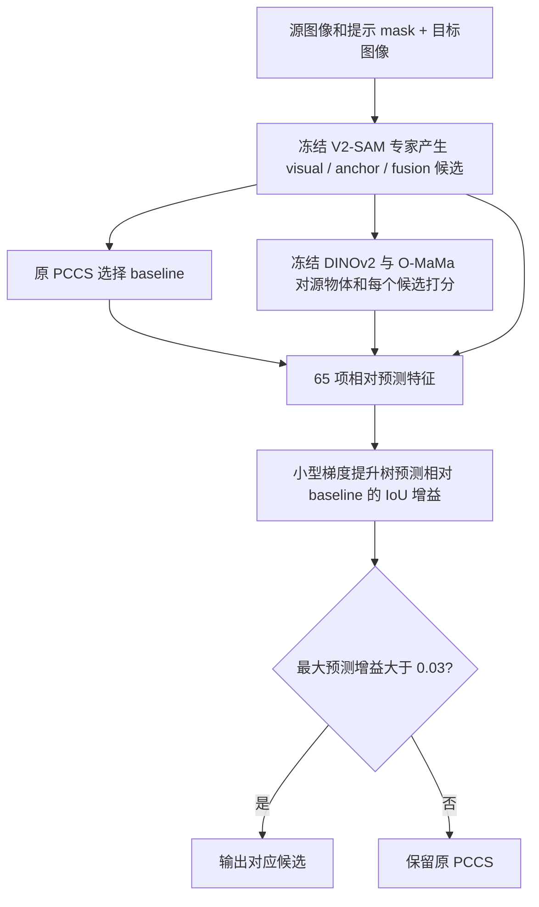

# Exo→Ego 全量涨点确认：完成

46,515 对图像、109,253 个对象、295 个拍摄序列。所有方法共用本次冻结的候选 mask，模型和阈值在测试前固定。

**2026-09-16 复核说明：本报告上述历史实验使用作者公开 Exo→Ego 权重，不是用户后来训练的 corrected Visual e19／Fusion e20。指标与推理链已复核通过；最佳修复版权重已在平台找到且与 Hugging Face 发布哈希一致。使用修复版权重的新实验单独记录，不能把两套基线混算。详见 `../pccs_pipeline_audit_20260916/AUDIT_REPORT.md`。**

| 方法 | Frame IoU (%) | 相对 PCCS (点) | 95% 拍摄序列 bootstrap 区间 |
|---|---:|---:|---|
| 原 PCCS | 53.6119 | 0.0000 | — |
| O-MaMa + 学习替换判断器 | 57.2772 | 3.6653 | [2.6849, 4.8846] |
| O-MaMa + 固定 0.05 门槛 | 56.3418 | 2.7299 | [1.8716, 3.7992] |

学习判断器的全量增益为 **+3.6653 个 IoU 点**。其 Dice、轮廓指标也改善，位置误差下降。

| 方法 | Frame Dice (%) | Frame ContA (%) | Frame LocE ↓ | Object IoU (%) | Object Dice (%) |
|---|---:|---:|---:|---:|---:|
| 原 PCCS | 58.4215 | 61.2772 | 0.079557 | 48.7024 | 53.5566 |
| O-MaMa + 学习替换判断器 | 62.5996 | 65.4734 | 0.063225 | 52.6130 | 58.0675 |
| O-MaMa + 固定 0.05 门槛 | 62.0700 | 64.8422 | 0.062119 | 51.6822 | 57.5595 |

## 方法与证据

冻结 V2-SAM 和 O-MaMa 主体，仅用 384 对官方训练样本拟合小型梯度提升树；另 128 对、拍摄序列不重叠的训练样本选择预测增益门槛 0.03。输入为 65 项预测信息，包括 O-MaMa 匹配分数、SAM 置信度、候选一致性和几何信息。测试标签不参与选择。

此前独立的 512 对、965 对象、64 序列测试，原 PCCS 70.9472% → 学习判断器 74.9235%，+3.9762 点，95% 区间 [2.5743, 5.4232]。这批序列与此前探索/确认批次不重叠。

全量测试包括此前探索与确认样本，因此它是冻结方案的全量基准，不是整个测试集从未被观察过的盲测。独立确认结果单独保留。此处确认的是 Exo→Ego 的整体选择方案收益，尚不能将收益单独归因于上下文，也不能外推到 Ego→Exo 或 Exo→Exo。判断器比固定 O-MaMa 门槛高约 0.94 点，这一差值未单独进行显著性检验。

## 当前方法的详细原理（按实际运行代码说明）

### 1. 任务目标、权重方向与当前结论

最终研究重点是 **Exo→Exo 跨外部视角分割的涨点**。此前优先开展 Exo→Ego，是因为该方向的 O-MaMa 公开匹配头和初步结果提供了可行性信号；这是探索顺序，不应被写成最终研究目标。本文上面的 53.6119%→57.2772% **仅是 Exo→Ego 评测结果**。

| 概念 | 含义 | 本报告已完成的实验 | Exo→Exo 应如何验证 |
|---|---|---|---|
| 评测方向 | 输入图像与目标图像的视角关系 | 外部视角→第一人称视角 | 外部视角 A→外部视角 B |
| V2-SAM 权重方向 | 用哪套已训练专家产生候选 | Exo→Ego 专家权重 | 没有专用权重时借用同一套 Exo→Ego 权重 |
| O-MaMa 匹配头 | 用哪套投影与注意力参数打分 | 公开 Exo→Ego 头，冻结 | 可以迁移该头，但必须记录其几何设置与域差异 |
| 新替换判断器 | 用什么数据学习候选替换 | Exo→Ego 官方训练数据拟合、训练内校准 | 首先零样本迁移，不能据 Exo→Exo 测试标签重选门槛 |

使用 Exo→Ego 权重不会把 Exo→Exo 数据变成 Exo→Ego 任务。评测方向由图像和标注决定。2026-09-16 已补做这套新判断器的 Exo→Exo 全量迁移，结果见文末；Ego→Exo 尚未验证。不能将 Exo→Ego 的 +3.6653 点直接外推到其他方向。

### 2. 整体结构：产生候选、跨视角匹配、预测替换收益

输入为源图像 `I_q`、源物体提示 mask `M_q`、目标图像 `I_t`。推理时不需要目标物体真值。最终输出为目标图像中的一个已有候选 mask。



这里新增的是候选选择模块。它不修改 mask 边界，不重新调用 SAM 细化选中的 mask，也不增加新的候选生成器。因而其能力上限受现有候选集合限制：如果所有候选都分错，单靠选择不能生成正确分割。

### 3. 候选集合与原 PCCS 基线

冻结的 V2-SAM 产生 `visual`、`anchor`、`fusion` 三种原始专家候选，并运行原来的 PCCS 路由得到 `M_b`。当前 Exo→Ego 的原路由为 `fusion_first`：fusion 通过原面积、连通分量等质量检查时优先选 fusion，否则使用原 visual/anchor 循环对应等回退逻辑。保持这段逻辑原样，是为了得到可比较的真实基线。

候选 bank 保存源提示 mask、三种原始候选和实际 baseline。打分时按 `baseline, visual, anchor, fusion` 顺序去除完全相同的二值 mask，因此同一物体最多有三个不同的原始候选，baseline 始终排第一。非空替代候选参与比较；空提示时直接保留 baseline。当前新门控没有额外套用旧 context 方案的质量门槛，而是把候选几何、置信度等交给回归器判断。

保存 mask 时只做二值化、位打包和无损压缩，不改变 mask 内容。生成器内部仍有随机区域采样，因此候选必须只生成一次；三个方法均在同一 bank 上比较。独立运行间可能出现候选差异，本报告的增益只减去同一次运行的 PCCS 基线。

### 4. O-MaMa 实际如何使用物体与周围信息

当前实现调用参考仓库的描述符和匹配头代码。它不是“在 mask 外画一个圆，再识别圆里的邻居物体”。具体有两类上下文：**扩张框内的局部外观**和**从另一张整图检索到的交叉注意力信息**。当前没有显式的邻居物体检测、实例关系图或语义标签匹配。

#### 4.1 特征提取和几何

新增打分分支使用冻结的 DINOv2 ViT-B/14-reg，特征维度为 768。V2-SAM 原候选生成仍沿用其 DINOv3 等原组件；两种骨干承担不同职责。

本次正式实验固定 `canonical` 几何：Exo→Ego 的源图像缩放为高 532、宽 952，目标为 700×700，与匹配头的 38×68 和 50×50 位置表对应。图像和 mask 使用适配器中固定的最近邻缩放，图像再作 ImageNet 标准化。patch 特征经双线性插值到输入图像约 1/4 的网格；对于 patch14，这相当于 patch 网格约 3.5 倍，不能写成“DINOv2 patch 网格固定 4 倍”。整数尺寸遵循源码取整。

这些是已经运行的几何设置，不意味着它们对 Exo→Exo 最优。若将外部视角目标也压成 700×700，就存在纵横比和位置先验迁移；后续必须作为明确的实验因素记录，不能悄悄改动后仍声称使用同一方案。

#### 4.2 物体描述符与局部上下文描述符

设插值后的特征为 `F(p)`，源或候选 mask 为 `M`。先把 mask 对齐到细网格，然后计算：

```text
o(M) = mean{F(p) : p 属于 M}                         # 768 维物体描述符
c(M) = mean{F(p) : p 属于 expand(bbox(M), 100 px)}   # 768 维局部描述符
d(M) = concat[o(M), c(M)]                            # 1536 维
```

扩张是预处理图像坐标中的 **bbox 每一边加 100 像素**，超出图像的部分裁掉，之后映射到细特征网格。它是矩形整框池化，框内包括目标自身和周围背景；没有减掉物体前景，因此不是纯背景环。也不是以 mask 面积为依据的 1.5 倍或 2 倍缩放。源物体和每个目标候选分别计算自己的框和描述符。细节如 bbox 宽高采用 `max-min`、边界裁剪和取整均跟随参考源码。

#### 4.3 双向交叉注意力与可学习匹配空间

令 `T_q, T_t` 是两张图的完整 patch token 序列，加上对应学习位置编码 `P_q, P_t`。使用公开预训练的交叉注意力和共享 MLP：

```text
a_q   = CrossAttention(query=o_q,   key/value=T_t + P_t)
a_tk  = CrossAttention(query=o_tk,  key/value=T_q + P_q)
z_q   = normalize(MLP(concat[a_q,  o_q,  c_q]))
z_tk  = normalize(MLP(concat[a_tk, o_tk, c_tk]))
s_full(k) = cosine(z_q, z_tk)
```

每个 MLP 输入是 3×768=2304 维，输出为 768 维匹配嵌入。这里的“交叉”是源物体描述符向目标整图取信息、目标候选描述符向源整图取信息，并非只在两个局部框之间做注意力。局部框信息则通过 `c_q/c_tk` 进入投影。公开 O-MaMa 已训练过这些参数；本实验严格加载并冻结，没有重新训练它们，也未使用其可见性分支作决策。

使用的分数是投影后余弦相似度。参考实现返回的最大分数还经过 sigmoid，但我们的 0.05 门槛定义在 **原始余弦分数差** 上，不是 sigmoid 概率差。

#### 4.4 提供给新判断器的四类匹配分数

| 分数名 | 实际计算 | 作用 |
|---|---|---|
| `omama_learned` | 上述完整 `s_full` | 物体、局部框与跨图信息共同参与的预训练匹配 |
| `omama_context_cross_zero` | 将 `c` 和 `a` 置零，保留物体输入，仍使用同一个预训练 MLP | 物体主导的辅助匹配线索 |
| `dino2_object` | `cos(o_q, o_tk)` | 未经 O-MaMa 投影的物体相似度 |
| `dino2_object_context` | `cos([o_q,c_q], [o_tk,c_tk])` | 物体与扩张整框拼接后的相似度 |

置零版本是对同一预训练头的推理干预，不是单独训练的 object-only 模型。最后一项也不是两个余弦的简单平均，它直接对拼接向量计算余弦。虽然打分脚本还计算了只关 context 或只关 cross 的诊断值，最终 65 项输入只使用上表四类分数。

### 5. 为什么需要学习替换判断器

O-MaMa 解决的是跨视角物体匹配；最大的语义相似度不必对应最准确的像素边界。一个漏分、连带背景或覆盖同类物体的候选也可能获得高相似度。原 PCCS 又已经有自己的有效选择，直接 top-1 替换会把一些原本正确的结果换坏。

因此新模块预测的是“候选相对当前 baseline 是否能提高 IoU”，而不是把 O-MaMa 分数直接当作 IoU，也不是判断哪种专家名称永远最好。

### 6. 65 项原始输入特征的确切组成

每个非空替代候选 `k` 与同一个 baseline `b` 构成一条回归样本。特征由 `gain_features.py` 的白名单生成：

| 组别 | 构造方式 | 数量 |
|---|---|---:|
| 专家身份 | 候选和 baseline 分别对 visual/anchor/fusion 作 one-hot | 6 |
| 四类匹配分数 | 每类取候选分数、baseline 分数、二者差、候选相对其他候选最高分的差 | 4×4=16 |
| 源物体和候选集合信息 | 下表所列全局量 | 7 |
| 候选自身的可靠性 | 12 种属性分别取候选值、baseline 值、二者差 | 12×3=36 |
| 合计 | 回归器前的原始输入 | **65** |

7 个全局量是：源 mask 面积比例、源 mask 连通分量数、当前图像对物体数、DINO 前向对应置信度，以及 visual-anchor、visual-fusion、anchor-fusion 三组 mask IoU。这里的候选间 IoU 是 **两个预测 mask 的一致性**，不是与目标真值的 IoU。

12 种局部属性是：面积比例、连通分量数、SAM 预测 IoU 分数、SAM IoU margin、SAM object logit、循环对应距离、DINO 反向置信度、前向对应点落入该 mask 的比例，以及四种概率图统计：

| 概率统计 | 代码中的定义 |
|---|---|
| `fg_mean` | 当前预测 mask 内的平均前景概率 |
| `margin_mean` | 整张概率图的 `mean(2×abs(p−0.5))` |
| `stability_iou` | `p>0.55` 与 `p>0.45` 两张嵌套 mask 的交并比；并集为空时取 1 |
| `uncertain_ratio` | 概率位于 `(0.4,0.6)` 的像素占比 |

SAM 预测 IoU 是模型输出的质量估计，不是真值评测 IoU。部分组件不提供的量在原记录中使用 `-1` 等约定值，当前保持该约定；`None` 或非有限值在特征提取中转成 NaN，再使用 **仅在拟合集学习的中位数** 填补，并加入缺失指示列。因此“65 维”是原始白名单向量长度，填补器输出可能多出缺失指示列，不能把树的实际输入长度无条件写死为 65。

### 7. 训练目标、样本权重和模型选择

仅训练小型回归器 `g_theta`。对拟合集中的图像对 `i`、物体 `j`、替代候选 `k`，目标为：

```text
y_ijk = IoU(M_ijk, GT_ij) − IoU(M_bij, GT_ij)
g_theta(x_ijk) ≈ y_ijk
loss = 加权平方误差；训练样本权重与 1/(N_i × K_ij) 成正比
```

`N_i` 是图像对物体数，`K_ij` 是该物体可用非空替代候选数。权重再除以所有训练样本权重的均值。这能减小多物体或多候选样本对拟合的过度影响；没有有效替代候选的物体不贡献回归样本，推理时仍保留 baseline。拟合共使用 **384 对、1,352 条候选回归样本**。标签使用上游评测几何：目标真值先最近邻变为 1024×1024，与冻结候选对齐。

预先限定的模型搜索为：岭回归 `alpha ∈ {1,10,100}`，以及一个 `HistGradientBoostingRegressor`。所有模型的填补器只在拟合集拟合；岭回归另外标准化，最终选中的树模型没有标准化步骤。树的设置为 `max_iter=100`、`max_leaf_nodes=7`、`min_samples_leaf=25`、`l2_regularization=10`、`random_state=42`；其余使用已固定的 scikit-learn 1.5.2 默认设置（平方误差回归，默认 learning_rate=0.1）。

在另 **128 对、225 个对象** 的训练内校准样本上比较模型和 `threshold ∈ {0,0.01,0.03,0.05}`，以 frame-mean IoU 选择；相同分数优先较少替换，无正收益则保留原 PCCS。最终选中梯度提升树和 **0.03**。校准数据不再并入拟合集重新训练。冻结后的序列化模型重放整个校准集，指标误差为 0。

### 8. 最终推理规则与两个门槛的区别

```text
先得到原 PCCS baseline b
若源提示为空或没有非空替代候选：返回 b
对每个替代候选 k：构造 x_k，并预测 d_k = g_theta(x_k)
k* = argmax_k d_k
若 d_k* > 0.03：返回候选 k*
否则：返回 b
```

0.03 是回归器预测的 IoU 增益门槛，即在 0～1 IoU 标度上的 3 个百分点；它不是保证每次替换都真实提高 3 点。回归器输出也不是概率，不要求在 0～1 内，当前实现不裁剪输出。相同预测值按候选顺序取第一个。

作为对照的 **固定 O-MaMa 门槛方法** 完全不使用新回归器：在非空候选中找完整 O-MaMa 分数最高者，只有其原始余弦比 baseline 高 **超过 0.05** 才替换；baseline 为空时选择可用候选。这一 0.05 和学习判断器的 0.03 量纲不同，不能互换解释。

### 9. 数据边界、可复现性与当前能证明什么

| 阶段 | 数据来源与规模 | 标签用途 |
|---|---|---|
| 判断器拟合 | 官方 Exo→Ego train，48 个序列×8 对=384 对 | 构造 IoU 增益回归目标 |
| 训练内校准 | 官方 train，另外 16 个序列×8 对=128 对 | 选择回归模型和门槛 |
| 独立确认 | 官方 test，另 64 个序列×8 对=512 对，965 个对象 | 固定模型评测，不重新选参数 |
| 本报告全量 | 官方 test，46,515 对、109,253 对象、295 个序列 | 冻结方案全量评测 |

各阶段的选择使用预先固定哈希和拍摄序列隔离。独立确认排除了此前 O-MaMa 探索和第一批确认的序列。官方验证集标注曾找到，但其图像当时没有找到，因此没有把训练内校准称为官方 validation。原 V2-SAM 专家已经看过官方训练集，这也是校准涨幅不能替代测试增益的原因。冻结指的是模型选择完成后；方案探索历史确实观察过此前小样本测试结果，不能声称整个研究过程完全未观察测试集。

mask 缓存在各 rank 的独立目录中，避免分布式 padding 样本写入同一文件。全量候选生成 seed 沿用上游 0，O-MaMa 打分 seed 为 42；不承诺跨 GPU、跨进程布局的候选逐位相同。关键保证是一次比较中的候选内容相同、身份覆盖精确。打分只使用 `prediction_inputs` 的白名单；篡改原记录中的目标 IoU、Dice、轮廓、位置与 oracle 指标后，128 个真实候选的输入向量不变。

可以确认：在当前 Exo→Ego 数据、候选和模型配置下，完整选择方案提高了全量 IoU，独立确认也支持正收益。尚不能确认：提升究竟来自局部框上下文、交叉注意力、预训练物体嵌入还是 SAM 质量特征中的哪一项；这些需要公平的组件消融。整体方案也不是纯免训练方法——主体冻结，但新增判断器确实进行了有监督拟合。对 Exo→Exo，需要单独验证迁移；对 Ego→Exo，还需适配它可能选择组合/阈值 mask 的 baseline，不能无检查地套用当前只接受三种专家身份的特征提取逻辑。

### 10. 实现与原始记录索引

以下路径相对于本报告所在目录，实际执行文件主要保存在远端同名实验目录：

| 文件 | 内容 |
|---|---|
| `aligned_model.py` | 冻结 DINOv2/O-MaMa 加载、几何处理与匹配分数 |
| `gain_features.py` | 65 项预测特征白名单及相对 baseline 构造 |
| `score.py` | 冻结判断器的逐候选推理与后置目标指标核验 |
| `cache.py` | 候选解包、去重和固定余弦门槛对照 |
| `summarize.py` | frame/object 汇总、按拍摄序列重采样的置信区间 |
| `manifest.json` | 配置、样本规模、权重和代码哈希 |
| `../pccs_gain_20260915/fit_gain_gate.py` | 判断器拟合和训练内校准 |
| `../pccs_gain_20260915/gate_training/fit_results.json` | 候选模型搜索记录、最终选择和输入列 |
| `../pccs_gain_20260915/gate_training/holdout/results.json` | 独立 512 对确认结果 |

O-MaMa 参考代码版本为 `0f187c65cb9d8f8df1d8b5f445edbb0485956d88`，保留其 AGPL-3.0 原始源码与许可；DINOv2 参考版本为 `7764ea0f912e53c92e82eb78a2a1631e92725fc8`。本实验借用原描述符和预训练匹配组件，候选来源替换为 V2-SAM，因此不是 O-MaMa 原始候选生成与训练流程的完整复现。

冻结判断器 SHA256：`f79543baa14e81ebc83fa3bb7458e0940e405afe31a556fb612281c6aa0d2678`。主报告对应运行中 `PCCS_CONTEXT=0`；早期 1.5/2 倍背景环的 context 路由没有与这套新判断器叠加。

## 完整性与资源

四个候选生成 rank 各完成 11,629 批、零跳过；最终精确覆盖 46,515 对和 109,253 个对象，打分对象分片为 27,314/27,313/27,313/27,313。全部候选 IoU 与记录核验最大误差低于 3.29×10⁻⁸；四个打分进程加载同一模型哈希，预训练 O-MaMa 严格加载且原 forward 一致性检查通过。bootstrap 按序列重采样，并对不同序列帧数保留 frame 权重。

平台任务 `v2sam-pccs-gain-exo2ego-full-20260915-r1` 于 2026-09-15 23:45:57 成功结束，运行 5 小时 59 分 38 秒，占用节点已为 0。没有停止共享 4090 实例。

文件：`runs/full/results.json` 为完整指标与回执；`manifest.json` 为冻结配置；`frozen_gate.joblib` 为远端模型；`resource_release.json` 为平台资源释放证据。

## 2026-09-16 补充：Exo→Exo 全量直接迁移

沿用同一套 Exo→Ego 专家、公开匹配头和判断器，不再训练或调门槛，在 **1,094 对、1,094 对象、20 个拍摄序列** 上单独评测。所有方法共用本次候选 bank。

| 方法 | Frame IoU (%) | 相对原 PCCS (点) | 95% 序列 bootstrap 区间 |
|---|---:|---:|---|
| 原 PCCS，使用 Exo→Ego 权重 | 38.4343 | 0 | — |
| 冻结学习判断器，预测增益门槛 0.03 | 39.8194 | +1.3851 | [-0.0288, 2.7435] |
| 冻结 O-MaMa，余弦优势门槛 0.05 | 40.0936 | +1.6593 | [-0.4837, 3.6114] |

**平均 IoU 有正收益，但两者的置信区间都跨过 0，尚未确认跨拍摄序列的稳定增益。** 学习判断器没有超过固定门槛，不能声称它在 Exo→Exo 上更优。判断器的 LocE 由 0.111046 略升至 0.112305；固定门槛为 0.110549，因此也不能说迁移后所有指标都改善。

这回答了“Exo→Ego 涨点，Exo→Exo 是否也会涨”：本次平均分确实上涨，但增益幅度和统计证据都不同。结果支持继续探索匹配信息的迁移价值，并不证明源方向的门控偏好可以无条件迁移。当前保留了源方向的 canonical 图像几何，尚未用公平消融区分几何、局部上下文、交叉注意力和质量特征的影响。

四个生成 rank 各 274 批、零跳过，打分对象为 274/274/273/273，覆盖 exact；缓存 IoU 核验最大误差低于 3.02×10⁻⁸。实验文件与原始日志位于 `../pccs_exoexo_transfer_20260916/`，平台任务为 `job-34b1c8a3-18b2-409f-9a1b-db3644048c4c`。
