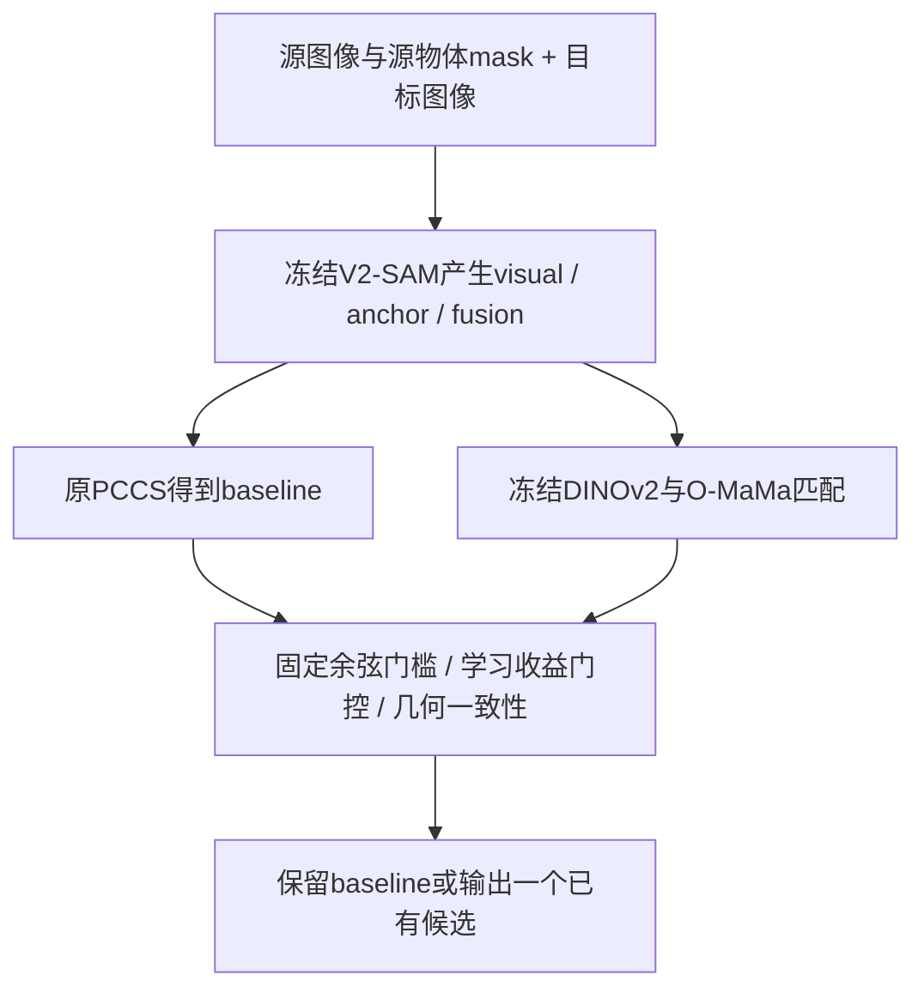

# V2-SAM PCCS／O-MaMa 实验总报告

> 唯一总报告；具体运行文件在各实验目录。更新到已取回并验证的机读结果，未完成项目保持待定。研究主目标为 **Exo→Exo 稳定增益**，Exo→Ego 用于验证源方向与比较迁移。

## 1. 当前结论与完整结果

- 指标与pipeline已按实验日记和`v2sam-pccs@0e3bc33`复核：新frame-level口径正确，零IoU保留，未发现历史DINO二次初始化或目标GT内容影响推理的问题；证据与边界见§5。
- 作者权重与用户修复版权重必须分列。前四组delta均减**同一轮、同权重、同候选bank**的PCCS基线；§9新增候选实验的主delta减当轮原O-MaMa几何一致性输出。
- 修复版权重Exo→Exo的预先指定主方案native-margin已获得正的95%序列bootstrap区间；几何一致方案点估计更高，但它是次要对照，未证明显著优于其他改进方法。
- “稳定”在这里指当前基准上主比较的统计证据，不是保证每个对象、每个随机种子或所有新场景都涨点。
- 修复版权重Exo→Ego全量已完成：预先指定的几何一致性主方案IoU 53.8997→56.6385，+2.7388点，95%区间[1.9556, 3.6700]。这轮canonical/native的数值非常接近，不应当成两份独立重复证据。
- 最新候选合并／质量适配探索已完成（§9）：Exo→Exo原一致性IoU 42.3980→42.4405，新增+0.0424点，95%区间[-0.2028, 0.3183]跨0；**未获得额外稳定增益**。小比例池化、可靠多点与rank-8 O-MaMa适配的负结果也完整记录。
- PCCS内部context首版已实现并完成训练内消融（§10），未使用O-MaMa网络。仅循环加权ΔIoU为0；仅Fusion复核/两项结合在校准分别为-0.3831/-0.4614点，均未晋级，未启动新目标测试。实现完整不等于已证明增益或创新性。
- 最新原生PCCS多方案已获得正增益（§11）：预选稠密循环置信度方案IoU 39.0190→41.3354，+2.3164点，95%区间[0.4173, 4.1413]。同候选O-MaMa参考为42.3980，尚未追平；显式邻域context没有显示额外优势，不能混写贡献归因。

### 1.1 全量 frame-level 指标

IoU／Dice／ContA 为百分数，LocE 为原始归一化距离（越低越好）。置信区间对应 **IoU 增益，单位百分点**。

#### Exo→Ego／作者权重

范围：46,515 对、109,253 对象、295 个拍摄序列。

| 方法 | IoU | Dice | ContA | LocE ↓ | ΔIoU | 95% 序列区间 |
|---|---:|---:|---:|---:|---:|---|
| PCCS 基线 | 53.6119 | 58.4215 | 61.2772 | 0.079557 | +0.0000 | — |
| 学习判断器（0.03） | 57.2772 | 62.5996 | 65.4734 | 0.063225 | +3.6653 | [2.6849, 4.8846] |
| 原几何 O-MaMa（0.05） | 56.3418 | 62.0700 | 64.8422 | 0.062119 | +2.7299 | [1.8716, 3.7992] |

完整机读结果：[results.json](runs/full/results.json)。

#### Exo→Exo／作者权重

范围：1,094 对、1,094 对象、20 个拍摄序列。

| 方法 | IoU | Dice | ContA | LocE ↓ | ΔIoU | 95% 序列区间 |
|---|---:|---:|---:|---:|---:|---|
| PCCS 基线 | 38.4343 | 43.0601 | 49.3730 | 0.111046 | +0.0000 | — |
| 学习判断器（0.03） | 39.8194 | 44.4688 | 50.7842 | 0.112305 | +1.3851 | [-0.0288, 2.7435] |
| 原几何 O-MaMa（0.05） | 40.0936 | 45.1509 | 51.7500 | 0.110549 | +1.6593 | [-0.4837, 3.6114] |

完整机读结果：[results.json](../pccs_exoexo_transfer_20260916/runs/full/results.json)。

#### Exo→Exo／修复版权重

范围：1,094 对、1,094 对象、20 个拍摄序列。

| 方法 | IoU | Dice | ContA | LocE ↓ | ΔIoU | 95% 序列区间 |
|---|---:|---:|---:|---:|---:|---|
| PCCS 基线 | 38.5257 | 43.0423 | 49.8778 | 0.107579 | +0.0000 | — |
| 学习判断器（0.03） | 41.1004 | 45.8611 | 51.7460 | 0.113841 | +2.5747 | [0.2836, 4.4629] |
| 原几何 O-MaMa（0.05） | 42.3595 | 47.3987 | 54.0980 | 0.102981 | +3.8338 | [1.3203, 5.9842] |
| 保持纵横比 O-MaMa（0.05） | 42.2665 | 47.3906 | 54.5521 | 0.102878 | +3.7409 | [1.5792, 5.7901] |
| 两几何一致才替换 | 42.5829 | 47.6861 | 54.8069 | 0.098797 | +4.0572 | [2.1297, 5.8095] |

主比较为**保持纵横比 O-MaMa**；其他区间是未作多重比较校正的探索性结果。旧学习判断器在作者权重候选上训练，本轮只是冻结迁移对照；它的LocE并未改善。

完整机读结果：[results.json](../pccs_corrected_exoexo_20260916/runs/full/results.json)。

#### Exo→Ego／修复版权重

范围：46,515 对、109,253 对象、295 个拍摄序列。

| 方法 | IoU | Dice | ContA | LocE ↓ | ΔIoU | 95% 序列区间 |
|---|---:|---:|---:|---:|---:|---|
| PCCS 基线 | 53.8997 | 58.6648 | 61.4913 | 0.077949 | +0.0000 | — |
| 学习判断器（0.03） | 57.1015 | 62.3927 | 65.2028 | 0.064154 | +3.2018 | [2.2440, 4.3387] |
| 原几何 O-MaMa（0.05） | 56.6352 | 62.2773 | 65.0120 | 0.062166 | +2.7355 | [1.9525, 3.6677] |
| 保持纵横比 O-MaMa（0.05） | 56.6329 | 62.2737 | 65.0029 | 0.062517 | +2.7332 | [1.9495, 3.6669] |
| 两几何一致才替换 | 56.6385 | 62.2786 | 65.0075 | 0.062326 | +2.7388 | [1.9556, 3.6700] |

主比较为**两几何一致才替换**，在本轮结果产生前已指定；其他方法为次要对照。

完整机读结果：[results.json](../pccs_corrected_exoego_20260916/runs/full/results.json)。

### 1.2 Object-level 与独立确认

Exo→Exo当前每pair恰有一个对象，object和frame指标相同；Exo→Ego的对象数不均，两套聚合不能混写。

| Exo→Ego 权重 | 方法 | Object IoU | Object Dice | Object ContA | Object LocE ↓ |
|---|---|---:|---:|---:|---:|
| 作者权重 | PCCS 基线 | 48.7024 | 53.5566 | 56.8509 | 0.083398 |
| 作者权重 | 学习判断器（0.03） | 52.6130 | 58.0675 | 61.3366 | 0.065611 |
| 作者权重 | 原几何 O-MaMa（0.05） | 51.6822 | 57.5595 | 60.7291 | 0.065190 |
| 修复版权重 | PCCS 基线 | 48.9687 | 53.7809 | 57.0650 | 0.082001 |
| 修复版权重 | 学习判断器（0.03） | 52.5777 | 57.9942 | 61.2241 | 0.066325 |
| 修复版权重 | 原几何 O-MaMa（0.05） | 52.0375 | 57.8188 | 60.9729 | 0.065171 |
| 修复版权重 | 保持纵横比 O-MaMa（0.05） | 52.0325 | 57.8123 | 60.9610 | 0.065527 |
| 修复版权重 | 两几何一致才替换 | 52.0392 | 57.8186 | 60.9645 | 0.065333 |

独立确认：作者权重下的512对／965对象／64序列holdout，PCCS **70.9472→74.9235**（学习判断器，+3.9762点，95%区间[2.5743,5.4232]）。这些序列排除了此前探索与第一批确认序列。后续全量包含历史已观察测试样本，因此全量是冻结方案的基准评测，不是整个测试集从未观察过的盲测。

## 2. 数据、权重和统计口径

### 2.1 任务方向与权重身份

Exo→Exo的源和目标都是外部相机视角；没有专用权重时借用Exo→Ego权重，**任务标签仍是Exo→Exo**。Ego→Exo的新判断器尚未评测；该方向PCCS可能选组合／阈值mask，需要先适配当前三专家身份特征，不能只改启动方向。

| 资产 | 来源／用途 | SHA256 或版本 |
|---|---|---|
| corrected Visual | 用户重训e19，926,619,220 bytes | `fd2e1b8f342c4468b45c962c61d4c914b9f6d71b6c6085014fb9a3ed2924b65f` |
| corrected Fusion | 用户重训e20，2,136,421,714 bytes | `8373b17180c198898fe9f9e39d09fe72991150ce3053b207b19e81986c60cab1` |
| 发布仓库 | `Travor278/V2-SAM`，两文件与平台逐字节一致 | `8b8310e9ee13023cb8711c2417e18cc7361dc3aa` |
| 原作者Visual／Fusion | 历史对照，来自`official_weights_wangzeze` | 分别以`55761ff4…`／`a4a09371…`开头，完整值在审计回执 |
| 冻结学习判断器 | 作者权重候选上训练的HGBoost | `f79543baa14e81ebc83fa3bb7458e0940e405afe31a556fb612281c6aa0d2678` |
| O-MaMa代码 | 公开Exo→Ego预训练匹配头；本轮冻结 | `0f187c65cb9d8f8df1d8b5f445edbb0485956d88` |
| DINOv2代码 | ViT-B/14-reg4，新增打分分支 | `7764ea0f912e53c92e82eb78a2a1631e92725fc8` |

修复权重的远端文件位于`codex_remote_ops/hf_publish_exo2ego_20260903/tmp/`。原始SAM2/DINOv3继续用于V2-SAM候选生成，新增DINOv2/O-MaMa负责候选匹配，不应混称为同一个骨干。

### 2.2 指标和可比性

```text
object-level = 所有对象指标的等权平均
frame-level  = mean_pair(mean_object_in_that_pair(metric))
```

零IoU对象保留。ContA是上游边界F-measure；LocE是最大外轮廓点坐标均值之间的距离除以图像对角线，并非mask面积质心距离。目标标注按上游nearest缩放为1024×1024，与预测对齐。置信区间使用10,000次按拍摄序列重采样，序列长度不等时保留frame的sum/count权重，不能改成每序列均值等权。

“全量”的范围：Exo→Ego为46,515对／109,253对象／295序列；Exo→Exo为已构建基准的1,094对／20序列，不是Ego-Exo4D所有可能外部相机组合。前者图像对约为后者42倍、对象数约100倍，所以四卡运行约6小时和约11分钟并不矛盾。

## 3. 方法原理与实际实现

### 3.1 从候选生成到最终输出



Exo→Ego原PCCS为fusion-first：fusion通过面积／连通分量质量检查时优先采用，否则按源mask和循环对应信息回退到visual或anchor。所有方法先保留这个真实baseline，再按`baseline, visual, anchor, fusion`顺序去重相同二值mask；空替代候选不参与比较，空源提示保留baseline。新增选择模块不会修改mask边界，也不能在所有候选都错误时生成正确分割。

候选只生成一次，按rank分别保存无损bit-packed缓存。上游RegionSampler仍使用随机抽点，所以跨GPU／跨分片重跑不保证逐位相同；同一次方法比较的mask内容则严格一致。

### 3.2 O-MaMa怎样提取物体和上下文

使用768维DINOv2 patch特征，双线性插值到输入约1/4网格（patch14网格约放大3.5倍，尺寸按源码取整）。mask最近邻对齐。

```text
o(M) = mean{F(p): p在物体mask内}                       # 768维
c(M) = mean{F(p): p在bbox每边扩张100px的矩形内}          # 768维
d(M) = [o(M), c(M)]                                    # 1536维
```

100px位于预处理图像坐标中，越界裁剪。框内包含物体自身和背景，**不是减去前景后的环，也不是1.5／2倍面积缩放**。源物体和每个目标候选分别取框。当前不显式检测邻居物体，也没有实例关系图。bbox宽高、整数取整和边界裁剪跟随原代码。

### 3.3 双向交叉注意力和匹配分数

```text
a_q  = CrossAttention(o_q,  target整图tokens + P_t)
a_tk = CrossAttention(o_tk, source整图tokens + P_q)
z_q  = normalize(MLP([a_q,  o_q,  c_q]))
z_tk = normalize(MLP([a_tk, o_tk, c_tk]))
s(k) = cosine(z_q, z_tk)
```

共享MLP把2304维投影为768维；注意力从另一张整图取信息，局部框描述符单独输入MLP。所有参数来自公开预训练头并冻结。当前不使用其可见性分支，也未复现原O-MaMa的整套候选生成和训练流程。

四种用于判断器的分数：完整预训练匹配；将局部context和cross输入置零、仍用原MLP的物体主导匹配；DINOv2物体余弦；拼接`[object,context]`后的余弦。最后一项不是两个余弦的简单平均。置零只是推理干预，不是独立训练的object-only消融。

### 3.4 几何与固定门槛

- **canonical**：Exo→Ego源高532×宽952、目标700×700，对应38×68和50×50学习位置表；图像／mask按适配器固定nearest缩放，图像作ImageNet标准化。迁移到Exo→Exo时这会一同迁移ego目标的方形先验。
- **native**：保留每张图纵横比，最长边≤1024、向下取14倍数，对学习位置表作双线性插值；其余匹配参数不变。
- **固定门槛**：非空候选中取最高完整匹配分数，原始余弦比baseline高**超过0.05**才替换；baseline为空时选可用候选。0.05不是sigmoid概率差。
- **几何一致性**：canonical和native分别执行上述规则，只有二者选中同一候选才替换，否则保留PCCS。它不新增训练，但增加两路匹配计算。

### 3.5 学习判断器：预测相对baseline的IoU增益

其目的不是把语义相似度当成分割IoU，而是识别“更像物体、但边界可能更差”的替换风险。每个候选构造65项原始输入：

| 组别 | 内容 | 数量 |
|---|---|---:|
| 专家身份 | 候选与baseline分别对visual/anchor/fusion one-hot | 6 |
| 匹配分数 | 四种分数各取候选值、baseline值、差值、相对其他候选最高分的margin | 16 |
| 全局信息 | 源mask面积比、连通数、pair物体数、DINO前向置信度、三组候选间IoU | 7 |
| 局部质量 | 12属性各取候选值、baseline值、差值 | 36 |

12属性为：面积比、连通数、SAM预测IoU、SAM IoU margin、SAM object logit、循环距离、DINO反向置信度、前向点落入mask的比例，以及概率图的前景均值、`mean(2|p−0.5|)`、`p>0.55`与`p>0.45`的稳定IoU、`0.4<p<0.6`的不确定比例。SAM预测IoU和候选间IoU都不是目标真值IoU。

缺失字段保留上游`-1`等约定；None／非有限值转NaN，用**拟合集**中位数填补，并增加缺失指示列。因此65是原始向量长度，不必等于填补器输出维数。

```text
y_ijk = IoU(candidate_ijk, GT_ij) − IoU(baseline_ij, GT_ij)
训练：加权平方误差，权重∝1/(pair对象数 × 该对象可用替代候选数)
推理：最大预测增益 > 0.03时替换，否则保留baseline
```

0.03是预测IoU增益的3个百分点，不保证每次真实增加3点；回归输出不是概率，不作0～1裁剪。它与余弦差0.05量纲不同。最终树为HistGradientBoosting，100次迭代、最多7叶、叶最少25样本、L2=10、seed42，其他参数沿用固定scikit-learn1.5.2默认值。

## 4. 训练／校准／测试边界与探索记录

判断器只在作者权重候选上拟合：48训练序列×8=384对，生成1352条候选回归样本；另16序列×8=128对／225对象用于校准。试验预先限定ridge alpha={1,10,100}与上述小树，门槛={0,0.01,0.03,0.05}，按校准frame IoU选择，相同值优先较少替换，无正收益则保留baseline。最终选小树0.03；校准数据不再并入训练。

原专家看过官方训练集，因此训练内校准收益不能作为测试收益；官方val标注虽找到，图像当时缺失，没有将train校准冒充官方validation。随后512对独立确认排除了早期探索／确认序列。修复权重实验继续使用旧树是**冻结迁移对照**，没有暗中重训。

| 早期探索 | 观察 | 含义 |
|---|---|---|
| 1.5／2倍背景环context | Exo→Exo原PCCS38.4343→均值context39.0209；Ego→Exo与Exo→Ego下降 | 简单扩背景未获跨方向统一收益 |
| O-MaMa32/64对探索 | 源方向出现较强信号，其他方向不一致 | 不能将小样本涨幅外推全量 |
| 首批512对独立确认 | canonical-margin约+1.11点但CI跨0；context/cross置零约−0.30点 | 不支持只保留物体分数即可解决问题 |
| 后续512对学习判断器确认 | +3.98点且CI为正 | 支持继续固定方案全量验证 |

上表只是方法演进记录，不能将其中不同候选、不同权重、不同样本的分数直接相减。源码随机采样是冻结bank设计的重要原因。

## 5. Pipeline复核结论

依据用户实验日记§2.2／§16与固定上游实现，完成静态身份、全量独立复算和真实模型检查：

| 检查 | 证据／结果 |
|---|---|
| 新frame/object口径 | 真实evaluator构造`[0,1]`与`[0.2]`两pair：frame0.35、object0.4，区别旧last-object／正IoU过滤0.6 |
| 零IoU与多卡覆盖 | 作者权重全量Exo→Ego32033、Exo→Exo455个baseline零IoU全部保留；逐pair对象数、身份集合和全量四指标独立复算通过，误差<3.8e-15 |
| DINO二次初始化 | 作者／修复两权重，每套forward及两个backward分支各368张量，MMEngine init前后未变且等于原DINO资产 |
| 权重实际内容 | Visual964、Fusion1335推理张量逐个匹配；修复权重仅额外忽略训练计数`contrast_schedule.step` |
| GT内容泄漏／输出路由 | 真实3对象与1对象pair，GT原值/零/一/随机；39/23个预测张量哈希及PCCS路由不变；Fusion输出来自Fusion分支 |
| 上游实现身份 | 11核心源文件可执行AST与0e3bc33一致，4个指标函数一致；文档/换行和跨Python空type_params单独处理，原始hash仍保留 |
| 仍存在的算法弱点 | soft-mask.nonzero随机区域采样、稀疏top1点均沿用上游；不伪称已修复 |

当前推理不执行旧对比损失／优化器，不涉及训练contrast调度或mid-epoch游标。目标mask的**形状**仍用于输出分辨率；反事实测试证明所测样本的GT内容不影响预测，不是对所有可能输入作无bug保证。每轮另要求所有rank零跳过、exact覆盖、缓存mask指标核验<1e-5及冻结模型hash一致。审计任务已成功释放。

完整回执：[AUDIT_REPORT.md](../pccs_pipeline_audit_20260916/AUDIT_REPORT.md)、[runtime_probe.json](../pccs_pipeline_audit_20260916/runtime_probe.json)、[read_only_audit.json](../pccs_pipeline_audit_20260916/read_only_audit.json)。

## 6. 后续探索：优先改善候选质量，再适配匹配器

| 优先级 | 方法 | 原因与验证方式 |
|---|---|---|
| 1 | 概率加权区域池化 | sigmoid soft mask通常处处非零，原nonzero采样近似包含全图。先在train/calibration固定样本比较概率加权、硬阈值与原采样，检查候选oracle是否提高；它改变训练分布，必要时只微调matcher／prompt投影，不能当作无代价bug修复 |
| 2 | 可靠多点对应 | 互为近邻、空间去重top-k和置信筛选，减小单个错误点对SAM的影响；固定坐标转换，k和阈值只在训练／校准选取 |
| 3 | 质量感知O-MaMa适配 | 在**修复权重候选**上重训小型IoU差排序／收益头，加入尺度和视角增强；主体冻结，独立校准后冻结测试 |
| 4 | 多尺度物体／背景可靠性 | 区分前景、框内邻域与跨图注意力，根据源目标尺度和候选质量学习可靠性，而非继续手工扫描测试倍率；与完整原头公平消融 |
| 5 | 更大独立Exo→Exo确认 | 当前只有20序列；增加未见外部相机组合／序列，固定单一主方案，并做组件归因。不能用重复测试替代独立证据 |

优先做**区域池化与可靠多点的训练／校准小实验**。当前O-MaMa门控只能选已有mask，改善候选本身更有机会突破上限。以上是有代码依据的研究假设，不承诺必然涨点；实际启动和结果状态见§8。

## 7. 实现、运行与维护索引

| 目录／文件 | 用途 |
|---|---|
| 本目录`score.py`、`gain_features.py`、`aligned_model.py` | 作者权重全量时的原始学习门控实现 |
| `../pccs_corrected_exoexo_20260916/` | 修复权重Exo→Exo；几何双路打分、完整日志和回执 |
| `../pccs_corrected_exoego_20260916/` | 修复权重Exo→Ego全量重跑，五方案同bank |
| `../pccs_gain_20260915/fit_gain_gate.py` | 判断器训练／校准与逐候选特征记录 |
| `../pccs_pipeline_audit_20260916/` | 日记对照审计、权重身份、初始化和反事实检查 |
| `../pccs_method/v2sam_pccs_gain.patch`（Git分支中） | 相对固定上游的可审阅候选生成补丁 |

GitHub：[Travor278/EgoExoSeg，pccs-omama-gain-20260916](https://github.com/Travor278/EgoExoSeg/tree/pccs-omama-gain-20260916)。代码、原始日志和哈希记录同步该分支；大型权重、图像和mask bank不入Git。O-MaMa相关适配保留AGPL-3.0来源与许可；DINOv2遵循其原许可。

运行沿用已审计的Python3.10.21／PyTorch2.3.1+cu121及任务专用依赖。四卡预检通过才跑全量；成功后核验平台状态和占用节点0。监督间隔按当前有效ETA的4/5动态调整，阶段切换或无可信ETA用5分钟。新结果只在覆盖和回执通过后更新§1；不得覆盖详细原理或改写历史基线。

### 7.1 运行收尾记录

| 任务 | 结束时间（北京时间） | 占用节点 |
|---|---|---:|
| v2sam-pccs-gain-exo2ego-full-20260915-r1 | 2026-09-15 23:45:57 | 0 |
| v2sam-pccs-exo2exo-transfer-20260916-r1 | 2026-09-16 00:29:35 | 0 |
| v2sam-corrected-exo2exo-geometry-20260916-r1 | 2026-09-16 01:30:53 | 0 |
| v2sam-corrected-exo2ego-full-20260916-r1 | 2026-09-16 07:43:55 | 0 |

## 8. 新增候选质量 2×2 消融（2026-09-16）

概率加权池化和可靠多点对应现已进入实际测试。四组为baseline、只改预测coarse-mask池化、只改可靠多点、两者结合；主体权重均冻结。源提示mask池化不改，加权分支保留原采样的RNG消耗；多点为严格双向最近邻、目标第一/第二匹配间隔≥0.01、双侧间隔≥2patch、最多3点，至少2点可靠时采用，否则退回原单点。

先用8对进行运行预检，再用128对／16训练序列筛查、另128对／16不重叠训练序列校准。上游专家已看过官方训练数据，故这不是独立测试收益。方案须同时改善筛查与校准候选oracle，且校准的固定几何一致性最终IoU为正增益；满足条件者按校准最终IoU选择，之后才比较预选方案与baseline的Exo→Exo结果。无合格方案则报告负结果，不在目标测试集调参。

分支隔离门要求：只改池化时Anchor不变；只改点时Visual不变；组合方案的对应分支与单项方案一致。不通过即停止。每个arm使用自己的新候选，并比较arm之间的同名最终选择方法；不能把某arm的新方法分数减去异次旧基线。

### 8.1 训练内筛查

| 候选方案 | Oracle IoU | 原PCCS IoU | 几何一致性 IoU | 多点对象数 |
|---|---:|---:|---:|---:|
| 原始候选 | 81.1412 | 75.6246 | 78.5232 | 0 |
| 概率加权池化 | 70.0293 | 59.8546 | 65.2305 | 0 |
| 可靠多点 | 80.7846 | 72.7973 | 77.5098 | 55 |
| 两者结合 | 69.7723 | 55.8673 | 63.9609 | 55 |

### 8.2 训练内校准

| 候选方案 | Oracle IoU | 原PCCS IoU | 几何一致性 IoU | 多点对象数 |
|---|---:|---:|---:|---:|
| 原始候选 | 84.5740 | 81.2286 | 82.6284 | 0 |
| 概率加权池化 | 75.1914 | 65.6650 | 70.8909 | 0 |
| 可靠多点 | 83.7519 | 77.4906 | 81.3119 | 55 |
| 两者结合 | 74.2194 | 62.7222 | 69.0050 | 55 |

训练内选择结果：`baseline`；规则按预注册计划执行。

**本轮三个改动方案均未通过晋级条件，保留原始候选，未启动Exo→Exo目标测试。** 这是冻结权重下的直接替换实验负结果，不是任务运行失败，也不代表已证明所有概率池化或多点方法无效。

在筛查／校准两个阶段，池化、点及组合的候选oracle均下降；因此损失已经出现在候选生成，而不只是最终选择器没有选好。直接把原随机非零区域采样替换为稠密概率平均，同时改变了特征聚合分布；原训练网络可能已经适应旧分布，但该解释尚需描述符分析或轻量适配验证。

多点实际在筛查55/243对象、校准55/225对象启用，最多3点，其余回退单点。双向最近邻和间隔筛选并未在本轮转化成更好的候选；不能把特征匹配的“可靠”直接等同于正确的分割提示。所有跨arm隔离门mismatch=0。

### 8.3 校准集相对原始候选的变化

| 改动 | ΔOracle IoU（点） | Δ最终一致性 IoU（点） | 最终变化95%序列区间 |
|---|---:|---:|---|
| 概率加权池化 | -9.3826 | -11.7375 | [-16.7766, -6.9976] |
| 可靠多点 | -0.8221 | -1.3165 | [-2.3228, -0.4583] |
| 两者结合 | -10.3546 | -13.6234 | [-19.4917, -8.0418] |

下一步如继续，应优先做较小的分布适配：保留原池化并加入小比例加权分量，在训练／校准上选择混合强度；或只微调prompt投影。多点可改成保留原单点、谨慎追加额外点并做质量检查。这些在§8结束时仅为未测试假设；随后已在独立实验中按顺序测试，结果见§9。V2-SAM prompt投影微调仍未执行。

本节候选质量实验使用5000次序列bootstrap；前面的选择器实验使用10000次。实现与完整回执：[候选质量实验计划](../pccs_candidate_quality_20260916/PLAN.md)。早期选择器实验的涨点不能归因于本节新增候选改动。

## 9. 保留候选、小比例池化与 O-MaMa 适配（2026-09-16）

本轮继续§8的负结果，按顺序测试：①保留原单点候选并加入可靠多点候选；②保留原池化并加入5%／10%／25%概率加权分量；③在修复权重的新候选上拟合质量增益排序器；④冻结O-MaMa主体，仅训练共享rank-8残差匹配投影。全部原候选和原几何一致性输出保留，作为候选集合及回退项。

前三种排序器为ridge α=10/100与3叶小树，29项输入仅含双几何匹配分数、候选来源和预测mask几何；监督是候选相对原一致性输出的IoU差。第④项在O-MaMa完整物体／100px框邻域／跨图注意力表征之后加768→8→768残差投影，初始为恒等映射；用筛查集候选IoU软分布训练，主体及V2-SAM权重不变。③④需要少量训练，不能称为training-free；④也不是V2-SAM prompt投影微调。

继续复用官方TRAIN内128对／243对象筛查、128对／225对象校准。只在筛查拟合，校准选模型；两者最终frame IoU都改善才晋级，按校准最终IoU选一个并冻结，再条件性验证Exo→Exo。训练内数据和目标benchmark此前已经用于探索，因此不把重复筛选当作盲测。新全量比较须使用同一逐pair随机种子的当轮原始基线，不直接减去§1的异次分数。

### 9.1 多点候选合并：已完成的离线回放

| 阶段 | 原一致性 IoU | 合并后 IoU | Δ最终（点） | Δ候选Oracle（点） |
|---|---:|---:|---:|---:|
| screen | 78.5232 | 78.2005 | -0.3227 | 0.0386 |
| calibration | 82.6284 | 82.3974 | -0.2310 | 0.1038 |

原候选保留保证该集合的oracle不降低，但不保证选择器最终涨点。本轮固定0.05阈值合并没有改善最终指标，新增可靠多点所提供的候选上限增量也很小。

### 9.2 小比例池化候选合并

| 增加候选 | 筛查Δ最终 | 校准Δ最终 | 校准ΔOracle |
|---|---:|---:|---:|
| residual005 | -0.0399 | -0.0045 | 0.0982 |
| residual010 | -0.1022 | -0.2226 | 0.1771 |
| residual025 | -0.9625 | -0.2357 | 0.4027 |
| all_union | -1.3106 | -0.6013 | 0.5299 |

以上都是固定余弦差0.05的描述性对照，单位为IoU百分点。5%接近不变，较大比例仍损害最终选择；全部合并在校准的候选上限增加0.5299点，但最终下降0.6013点。候选有所补充，如何选好仍待排序器／适配验证。

### 9.3 后续运行状态

当前任务 `v2sam-candidate-union-adapt-20260916-r4`；最近已核验状态：`complete`，阶段：`complete`。单任务最多4张H100，成功／失败均保留1分钟。尚无完整结果时不宣称涨点。

运行诊断：r1在O-MaMa embedding重放校验出现0.000308最大偏差，超过1e-4容差，停止于拟合前。r2单独切换cuDNN TF32未解决，故不能将原因归结于cuDNN。r3继续检查GEMM精度及原组／扩大候选组，保持原容差；历史失败证据归档，已完成候选缓存继续复用。r1／r2均已释放节点。

r3确认GEMM TF32开启时原候选组重放误差为0，但扩大候选批次仍可引入>1e-4的数值偏差。r4修复为：共享冻结DINO图像特征，按每个原候选组的大小与顺序调用匹配头，再合并候选embedding；不放宽校验。诊断对象最大误差降至5.96e-8，原始分数保留，随后继续逐对象重放检查。r3也已释放节点。此修复不改变任何已生成mask或原始评价结果。
训练内冻结选择：`ridge10_t0.05`。
筛查相对原一致性输出+0.2348点，校准+0.2078点；校准替换24个对象，其中改善16、变差8。这是训练内选择结果，不能据此宣称目标集稳定涨点。

| 配置 | 筛查Δ最终 | 校准Δ最终 |
|---|---:|---:|
| ridge10_t0.05 | +0.2348 | +0.2078 |
| ridge100_t0.01 | +0.0566 | +0.0017 |
| tree_t0.05 | +0.5885 | -0.0588 |
| omama_adapter_e5_m0.1 | +0.1811 | -0.4474 |
| omama_adapter_e15_m0.1 | +0.7708 | -0.1499 |
| omama_adapter_e40_m0.1 | +1.3941 | -0.7815 |

完整配置均在[model_search.json](../pccs_candidate_union_20260916/model_search.json)记录，以上是紧凑摘录。O-MaMa残差投影共640个优化步，loss有限、零初始化恒等检查通过，但所有预设投影配置在校准集均下降；筛查上涨、校准下降呈现过拟合信号。因此本轮不将该投影送入目标测试。选中的ridge质量排序器也未经过目标集重新拟合。

### 9.4 Exo→Exo全量最终结果

| Exo→Exo方法 | Frame IoU | Dice | ContA | LocE ↓ |
|---|---:|---:|---:|---:|
| original_pccs | 39.0190 | 43.6732 | 50.4196 | 0.105621 |
| original_consensus | 42.3980 | 47.5738 | 54.9120 | 0.098738 |
| selected_union | 42.4405 | 47.5832 | 54.6547 | 0.099163 |

相对当轮原一致性输出变化0.0424点，take配对bootstrap 95%区间[-0.2028, 0.3183]；覆盖1094对／1094对象。

**本轮未获得额外稳定增益，不升级替换现有主方案。** IoU微升，但区间跨0；ContA与LocE也未改善。新方法相对原PCCS的总体差值主要继承既有O-MaMa收益，不能全部归因于新增候选或新排序器。当前pair固定种子与§1历史全量不同，须以本表的当轮基线作配对比较。

独立复算：全部1094对象、20个take覆盖精确；原PCCS的440个零IoU对象保留；三池化分支Anchor mismatch均0，所有原候选保留，四指标复算最大误差0.0e+00，bootstrap及冻结模型SHA一致。匹配分数重放最大误差2.384e-07。共替换89对象，改善30、变差27，其余IoU不变。

候选Oracle IoU由47.0697升至48.5325（+1.4629点），说明集合中有新增有效mask；最终选择未有效兑现这些增量。Oracle用GT仅作事后诊断，不能作为可部署结果。

下一轮更值得验证的是：扩大且按take严格隔离的训练候选bank，训练成对的候选质量差并强化困难负例；或对前景、邻域与跨图注意力分别做可靠性校准。先在训练内观察泛化，再固定单一方案作新的独立确认。当前16个筛查take上的小投影已呈现过拟合，不宜仅继续加大投影或扫描目标集阈值。此处为后续假设，本轮没有执行这些新方案。

资源收尾：平台状态已成功，占用节点0，结束时间2026-09-16 17:25:30（北京时间）。

实现、冻结规则与完整运行证据见[本轮计划](../pccs_candidate_union_20260916/PLAN.md)。监督间隔按有效剩余ETA×4/5动态调整；初始化／切换阶段采用5分钟。

## 10. 方法定位修正：PCCS内部上下文增强

根据用户最新要求，后续主线回到PCCS本身。§3及此前使用公开O-MaMa头/权重的实现，明确作为**外接匹配器组合基线**保留，其借用部分不能写作我们的原创context机制。已有候选生成未被删除，但最终决策可被外部匹配结果覆盖，这与在PCCS循环验证内部增强context不同。

新主方案复用现有DINOv3与前后向对应，在原循环支持票/置信度中加入可靠的邻域语义证据，并独立处理fusion-first早退出：只有可靠context冲突时转入原PCCS循环复核。上下文缺失或不可靠时回到原流程。先固定候选验证选择机制，再单独研究context改善前向点定位，避免混淆归因。

**首版内部增强已实现，真实实验状态与结果见§10.1之后。** 方向有合理动机，但创新性与效果均需文献对照、组件消融和独立验证；既有O-MaMa组合增益不能代替这些证据。完整实现边界与消融计划：[PCCS内部context计划](../pccs_native_context_20260916/PLAN.md)。

### 10.1 已实现的原生PCCS context模块

复用原Visual/Anchor和Fusion反向对应模块已提取的DINOv3特征，额外编码器前向次数为0。用源/预测mask外的1.75倍bbox邻域，检查全图双向最近邻是否落入对方物体邻域；匹配要求cosine≥0.4、top1−top2≥0.02，双向至少各1个、合计4个。可靠性r=min(1,N/8)×sqrt(平均有效覆盖率)，r≥0.2时原循环成功票乘以1−0.5r(1−support)；Fusion的可靠context支持<0.25则转入原循环复核。

原函数`_count_points_in_mask`实际检查源mask外接矩形，首版保留这个精确定义及原距离平票规则。context权重在首版按对象/专家区域共享，并非逐点关系网络；错位对照将源邻域平移半幅图像且扣除源前景。没有O-MaMa匹配头、额外DINOv2或新参数训练。

所有设置共享原三专家mask；8对smoke另做捕获开/关完整预测签名检查，各阶段验证λ=0精确回归及与旧baseline的候选SHA/PCCS路由一致。当前训练内样本此前已参与探索，不能称为独立验证。

最近已核验状态：complete，阶段complete。结果只在精确覆盖及一致性检查通过后写入下表。

### 10.2 screen（128对/243对象）

| 设置 | Frame IoU | ΔIoU（点） | 95% take区间 | 改善/变差对象 |
|---|---:|---:|---|---|
| 原PCCS | 75.6246 | +0.0000 | [0.0000, 0.0000] | 0/0 |
| λ=0 | 75.6246 | +0.0000 | [0.0000, 0.0000] | 0/0 |
| 仅循环加权 | 75.6246 | +0.0000 | [0.0000, 0.0000] | 0/0 |
| 仅Fusion复核 | 75.2012 | -0.4234 | [-0.9311, -0.0459] | 3/8 |
| 两者结合 | 75.2012 | -0.4234 | [-0.9311, -0.0459] | 3/8 |
| 错位context对照 | 75.6246 | +0.0000 | [0.0000, 0.0000] | 0/0 |

原Fusion接收179对象，其中context触发复核11；可靠context对象数{'visual': 45, 'anchor': 38, 'fusion': 48}。原候选逐位一致，λ=0路由一致。错位对照不得参加选型，其他组件的区间作为探索性对照解释。

### 10.3 calibration（128对/225对象）

| 设置 | Frame IoU | ΔIoU（点） | 95% take区间 | 改善/变差对象 |
|---|---:|---:|---|---|
| 原PCCS | 81.2286 | +0.0000 | [0.0000, 0.0000] | 0/0 |
| λ=0 | 81.2286 | +0.0000 | [0.0000, 0.0000] | 0/0 |
| 仅循环加权 | 81.2286 | +0.0000 | [0.0000, 0.0000] | 0/0 |
| 仅Fusion复核 | 80.8455 | -0.3831 | [-1.2102, 0.0687] | 1/4 |
| 两者结合 | 80.7672 | -0.4614 | [-1.3535, 0.0687] | 1/4 |
| 错位context对照 | 81.1898 | -0.0388 | [-0.1163, 0.0000] | 0/2 |

原Fusion接收188对象，其中context触发复核5；可靠context对象数{'visual': 21, 'anchor': 21, 'fusion': 25}。原候选逐位一致，λ=0路由一致。错位对照不得参加选型，其他组件的区间作为探索性对照解释。

训练内冻结选择：`baseline`。
三个新增设置均未同时通过筛查与校准的正收益条件；保留原PCCS，未进入目标测试。

### 10.5 本轮结论与后续假设

**内部模块已实现且运行检查通过，但首版机制没有获得增益。** 仅循环票数加权在筛查/校准均未改选；Fusion复核使筛查下降0.4234点、校准下降0.3831点，两项结合校准下降0.4614点。错位对照也没有正收益，不能据此声称真实context有效。

校准中原有37个PCCS回退对象，仅5个在Visual或Anchor有可靠context，且本轮单独循环加权均未改选。被强制复核的5个Fusion对象，原平均object IoU为88.53%，复核后67.95%。这是触发子集的对象平均，不能混同上表整体frame指标。

低邻域支持可能来自视角/遮挡造成的上下文变化，首版将其用作Fusion否决条件，实际损失多于收益。下一步应分别验证：context只在候选之间提供可靠的相对支持；在原反向/前向对应选点阶段帮助处理歧义，避免仅给已为0的成功票减权；保留不确定性回退。这些是新的待验证假设，尚未继续运行。

独立复算四指标误差为0，10000次take bootstrap一致，零IoU保留；8对开/关完整预测比较通过，全部阶段λ=0路由一致且原候选SHA一致。没有加载O-MaMa或训练新参数。完整核验：[final_validation.json](../pccs_native_context_20260916/final_validation.json)。

资源收尾：已成功，占用节点0，结束时间2026-09-16 23:53:35（北京时间）。

源码与冻结计划：[原生context实验](../pccs_native_context_20260916/PLAN.md)。

## 11. PCCS稠密循环与context多方案（2026-09-17）

重新核对O-MaMa实现后，本轮借鉴区域证据、跨图软信息和邻近干扰消歧的动机，将其实现为PCCS内部的循环置信度修正；不加载O-MaMa网络、DINOv2或其参数。8个固定规则与24个小型校准器配置共享原三专家候选。完整定义：[本轮计划](../pccs_dense_context_20260917/PLAN.md)。

### 11.1 机制与接入

在原反向DINOv3特征上对patch余弦矩阵以τ=0.07做双向softmax。令u为源mask向目标候选传输的平均概率质量，v为候选向源mask传输的平均质量，soft-cycle=2uv/(u+v)；另记录源mask→候选→源mask的两跳返回质量。它提供硬循环票数为0时仍可比较的连续证据；两种统计不能混写。

在1.5/2倍bbox外环分别计算：物体区域余弦；物体与对侧背景的交叉相似度；前景相对背景的差；减去0.5倍本侧背景原型后的区域余弦；对象循环质量相对邻域泄漏的差。对应关系仍来自自己的DINOv3匹配，不复制O-MaMa的可学习cross-attention/MLP结构。

原PCCS先运行，只有另一候选通过原mask质量门、soft-cycle高于原选择至少0.005且绝对值>0.01时，才允许修正。无配置/strength=0直接返回原结果；缺少上下文不会单独否决Fusion。native_bridge.py接入原PCCS决策位置，目标阶段要求实际接口决策与冻结policy回放逐对象一致。

### 11.2 训练、对照与选择

fit扩大到48个take/384对，另16个take/128对校准；原专家已见过TRAIN，当前校准也曾用于探索。固定规则不训练；小校准器仅拟合原PCCS点票数/距离/SAM质量及本轮证据对应的质量差，不微调专家或骨干。4-fold按take留出产生OOF预测，校准不进入拟合。base/cycle/context/full四种输入共享相同软循环准入；各用ridge10、ridge100、3叶小树和0.03/0.05门槛。

仅OOF（固定规则为TRAIN表现）和校准都正的方案可晋级，按校准选唯一主方案并冻结。同容量输入消融及错位context一起冻结，目标不得重选。O-MaMa只读取相同旧候选bank上的冻结输出作参考，不作为本轮训练/推理输入。判定是否接近它的增益应看同一轮配对比较和区间。

当前已核验状态：complete，阶段complete。未完成时不宣称涨点。

| 家族中校准最高配置（仅摘要） | TRAIN OOF/固定规则ΔIoU | 校准ΔIoU |
|---|---:|---:|
| joint15 | -0.8327 | -0.9342 |
| base_ridge10_t0.05 | +0.4028 | +0.3277 |
| cycle_ridge10_t0.03 | +0.2570 | +0.3564 |
| context_ridge100_t0.03 | +0.3158 | +0.2973 |
| full_ridge100_t0.05 | +0.1818 | +0.2746 |

此表不等于晋级名单，完整搜索与负结果见search.json；必须另满足OOF为正。

冻结主方案：`cycle_ridge10_t0.03`。

### 11.3 Exo→Exo冻结确认

| 方法 | IoU | 相对原PCCSΔIoU | 95%take区间 |
|---|---:|---:|---|
| baseline | 39.0190 | +0.0000 | [0.0000, 0.0000] |
| primary | 41.3354 | +2.3164 | [0.4173, 4.1413] |
| wrong_context_primary | 41.3354 | +2.3164 | [0.4173, 4.1413] |
| base_matched | 40.5826 | +1.5635 | [0.1653, 3.3658] |
| cycle_matched | 41.3354 | +2.3164 | [0.4173, 4.1413] |
| context_matched | 41.0676 | +2.0486 | [0.5548, 3.7788] |
| full_matched | 41.1937 | +2.1747 | [0.4971, 3.8963] |
| omama_reference | 42.3980 | +3.3790 | [1.3670, 5.1190] |

主方案相对冻结O-MaMa参考：-1.0626点，95%区间[-2.2367, 0.3297]。主方案在PCCS实际接口中的选择与离线回放一致。不能把不含context校准器的增益归到context。

**原生方案在当前基准获得正增益，但没有追平O-MaMa的点估计。** 第一批预选主方案是cycle_ridge10_t0.03，使用原PCCS信息、软循环统计及区域物体余弦，不包含显式邻域描述符；因此其错位context对照应与主方案相同。显式context/full同容量对照没有优于该主方案，当前收益不能写成“局部邻域context已证明有效”。

### 11.4 缓存上的后续机制消融

训练内发现：校准82个对象有更好的合格替代候选，但原始软循环硬门只覆盖7个。第二批据此比较原门、非零支持门和跨尺度正向context准入；第三批按随机对应的面积先验，对forward/backward/两跳循环概率作log-lift校正。两批都重放同一48-take划分，源OOF与校准选型后才读取本轮完整目标结果。

| 冻结方案 | TRAIN OOF ΔIoU | 校准ΔIoU | Exo→Exo ΔIoU | 目标95%区间 |
|---|---:|---:|---:|---|
| 相对context准入 | +0.4943 | +0.3856 | +2.2920 | [0.4019, 4.1138] |
| 面积先验校正 | +0.7152 | +0.4319 | +2.1214 | [0.7991, 3.3462] |

第二批主方案通过真实native_bridge入口对缓存mask逐对象核验，且标签反事实不改变选择；第三批是冻结policy的缓存回放，其R1控制逐对象复现真实接口结果，尚未单独部署第三批到新分割推理任务。两批均没有超过第一批的目标点估计；保留各自预选结果，不用目标集重新选超参数。第三批相对O-MaMa区间全部低于0，不能称为等效。

本地重新生成GroupKFold时发现折分配与远端不同，首次本地复现停止于选型之前；随后直接使用远端保存的take列表，原R1各配置的OOF和校准差值精确复现。该诊断及第一次结果保留在gate_study中。

### 11.5 推理重复性、共享候选与核验

目标首次在knife对象处触发历史SHA检查并停止。单卡重复OFF/OFF/ON/ON/OFF确认：第二次未加新模块的Fusion本身与首次相差25像素，Visual/Anchor和原路由不变，IoU/Dice/ContA均为0，LocE略变；不能将差异归因于context，也没有证实底层成因。恢复采用固定当前候选bank、记录历史差异、必要时在独立参考进程重算O-MaMa的协议，避免混用候选。

最终恢复的1094对全部与历史候选SHA及原PCCS输出一致，实际参考重算数为0。三批主方案的指标与10000次take bootstrap独立复算通过，原PCCS440个零IoU对象保留。原生方法没有使用O-MaMa网络或权重。完整证据见final_validation.json、failure_probe.json及各阶段回执。

本批资源已释放：已成功，占用节点0，结束时间2026-09-17 01:45:41（北京时间）。

### 11.6 下一步：原生局部视图循环

目前已获得约2.3点原生增益，距离同bank O-MaMa约1.06点。下一步研究原DINOv3的物体局部视图与全图循环联合，并加入同分辨率前景-only crop对照，区分放大细节与context的作用。ROI几何模块和测试已准备，完整实验尚未启动；计划见[局部视图循环](../pccs_roi_context_20260917/PLAN.md)。

几何说明修正：原BackwardCorrespondenceMatcher实际上保持图像纵横比，将高度归一到768、宽度取16倍数。早期native_context.py的“方形网格”注释不准确，但执行代码使用实际返回网格尺寸处理mask，没有硬编码方形。不能用“原图被拉成正方形”解释此前负结果。

## 12. 固定 100 像素上下文与 Exo→Ego 原生验证（2026-09-17）

用户提出固定100像素范围可能优于1.5/2倍bbox。核对O-MaMa官方DescriptorExtractor：bbox每边各扩100，边界裁剪，池化包含前景的整框；100定义在预处理后的图像坐标。此前倍率纯背景环不是这一实现。此次只借鉴区域构造，将证据加入原PCCS挑战候选判断，不导入O-MaMa网络或替换PCCS。

设置50/100/150原生像素整框与纯背景环、1.5/2倍整框与纯背景环、O-MaMa canonical图像坐标的100像素整框与环，共12种。原生坐标指DINOv3输入高768/宽保持比例；canonical范围按source532×952、target700×700归一化映射。后者仅区域范围对齐，仍用原生DINOv3特征，并非复现O-MaMa的DINOv2四分之一尺寸插值池化。bbox采用像素外边界，相比其xmax/ymax最多差一个像素，已记录。

区域权重为连续bbox对每个token格子的面积占比；背景环再扣除前景覆盖率。相同六项上下文证据加入原生软循环置信特征，保持原候选、对应点、cycle-dominance准入和回退。比较原cycle、历史ring15/ring20和12个区域组，Ridge10/100、阈值.03/.05共60个源域配置，固定四折take列表，按48个TRAIN takes的OOF及16个校准takes冻结。目标上报告匹配容量对照与错位邻域控制，不按目标结果选型。

Exo→Ego先验证既有512对/965对象/64 takes holdout，包括上一轮冻结cycle_ridge10_t0.03及本轮源域预选方案；它与拟合/校准takes互斥，但历史被评估过，不能称全新盲测，也不是46515对全量。Exo→Exo继续1094对全量。实际PCCS接口选择与缓存回放逐对象核对；source原生特征、候选SHA和原路由对照上一轮，确保比较不是由候选变化造成。详细协议见[固定像素实验计划](../pccs_fixed_context_20260917/PLAN.md)。

源域选型已完成，主方案冻结为`px150_box_ridge10_t0.05`，OOF +0.3219点、校准+0.3919点；两个源域区间均跨零，不能由此宣称稳定增益。原cycle各配置的OOF/校准精确复现上一轮，未按目标集改选。

| 同正则/阈值的区域对照 | TRAIN OOF增益（点） | 校准增益（点） |
|---|---:|---:|
| cycle | +0.2534 | +0.3398 |
| old_ring15 | +0.3566 | +0.2739 |
| old_ring20 | +0.3149 | +0.2739 |
| px50_box | +0.0910 | +0.3488 |
| px50_ring | +0.0545 | +0.3488 |
| px100_box | +0.0962 | +0.3692 |
| px100_ring | +0.3444 | +0.3692 |
| px150_box | +0.3219 | +0.3919 |
| px150_ring | +0.2949 | +0.3571 |
| scale15_box | +0.1493 | +0.3133 |
| scale15_ring | +0.0522 | +0.3073 |
| scale20_box | -0.1096 | +0.2739 |
| scale20_ring | -0.1191 | +0.3095 |
| om100_box | +0.3354 | +0.3571 |
| om100_ring | +0.1828 | +0.3571 |

100像素整框与环均保留为预先声明对照，150像素主方案只由源域规则选中；后续不能把目标集上最好的某一行追认成预选主方案。

### 12.1 Exo→Ego 512对 holdout

源域预选：`px150_box_ridge10_t0.05`。所有下列对照均冻结后评测。

| 方法 | frame IoU | 相对原PCCS增益（点） | take bootstrap 95%区间 |
|---|---:|---:|---|
| baseline | 70.9748 | +0.0000 | [0.0000, 0.0000] |
| primary | 71.8485 | +0.8737 | [0.3319, 1.5337] |
| frozen_cycle | 71.8041 | +0.8293 | [0.2853, 1.4973] |
| wrong_context_primary | 71.8207 | +0.8460 | [0.2846, 1.5291] |
| cycle_matched | 71.8419 | +0.8672 | [0.3268, 1.5270] |
| old_ring15_matched | 71.7788 | +0.8040 | [0.2868, 1.4427] |
| old_ring20_matched | 71.6397 | +0.6649 | [0.0297, 1.3658] |
| px50_box_matched | 71.8270 | +0.8522 | [0.3199, 1.4983] |
| px50_ring_matched | 71.7614 | +0.7866 | [0.2755, 1.4254] |
| px100_box_matched | 71.8179 | +0.8432 | [0.3225, 1.4833] |
| px100_ring_matched | 71.7584 | +0.7836 | [0.2739, 1.4123] |
| px150_box_matched | 71.8485 | +0.8737 | [0.3319, 1.5337] |
| px150_ring_matched | 71.8415 | +0.8667 | [0.3259, 1.5288] |
| scale15_box_matched | 71.7355 | +0.7607 | [0.2289, 1.4097] |
| scale15_ring_matched | 71.6735 | +0.6987 | [0.1873, 1.3411] |
| scale20_box_matched | 71.7633 | +0.7886 | [0.2778, 1.4238] |
| scale20_ring_matched | 71.7622 | +0.7875 | [0.2767, 1.4235] |
| om100_box_matched | 71.8619 | +0.8871 | [0.3655, 1.5244] |
| om100_ring_matched | 71.7340 | +0.7593 | [0.2436, 1.3904] |

本轮主方案相对上一轮冻结cycle额外变化：+0.0444点，区间[-0.0083, 0.1121]。区分总增益和context的额外贡献，不能将原cycle本已有收益算作新增context收益。

| 配对的额外贡献/几何比较 | IoU变化（点） | 95%区间 |
|---|---:|---|
| 原生100px整框 − 同阈值cycle | -0.0240 | [-0.1561, 0.0747] |
| canonical100px整框 − 同阈值cycle | +0.0199 | [-0.1260, 0.1566] |
| 预选150px整框 − 同阈值cycle | +0.0066 | [-0.0329, 0.0515] |
| 预选方案 − 错位邻域 | +0.0278 | [-0.0503, 0.1375] |
| 100px整框 − 100px环 | +0.0595 | [-0.0223, 0.1954] |
| 100px整框 − 1.5倍整框 | +0.0825 | [-0.0115, 0.2090] |
| 100px整框 − 2倍整框 | +0.0546 | [-0.0335, 0.1760] |
| 100px环 − 2倍环 | -0.0039 | [-0.0578, 0.0543] |

这些是描述性配对比较，不按目标数值重新选择模型。IoU点估计略高但区间跨零时，不能声称该区域定义已带来稳定额外收益。

运行记录：R1完成8对Capture开关/strength0回退检查、384对TRAIN及128对校准，原生特征/候选/路由一致性通过。Exo→Ego首次误用TRAIN-only图片根目录，四个分片均在第一条预测前发生空图像列表错误；该次没有目标指标。失败日志已保留，节点归零。R2仅修复测试图片根目录，采用此前全量成功配置并逐文件预检；不重拟合、不改选已冻结模型或阈值。

ROI裁图重编码属于另一机制，暂缓，优先完成用户明确要求的固定像素区域池化。
