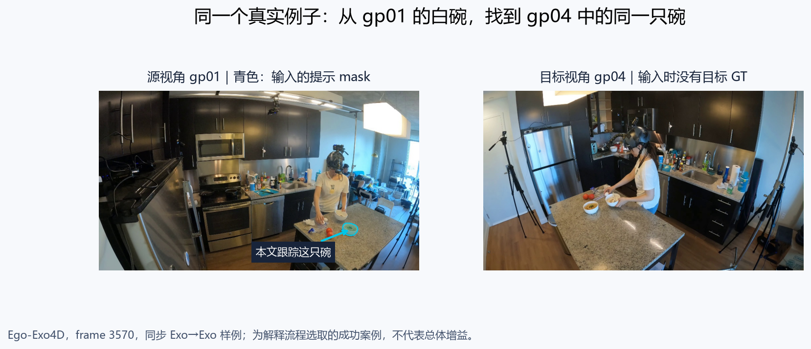
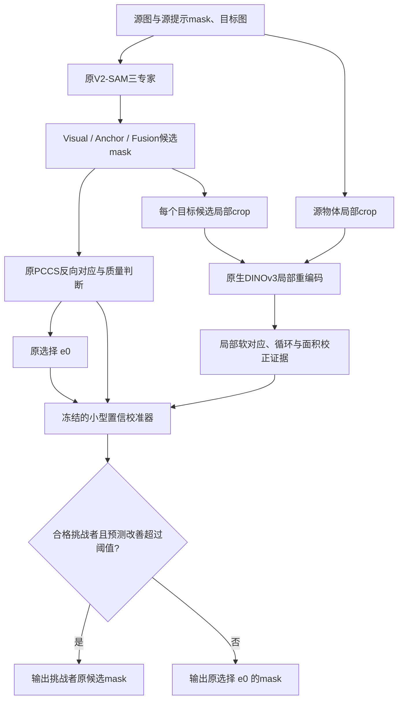
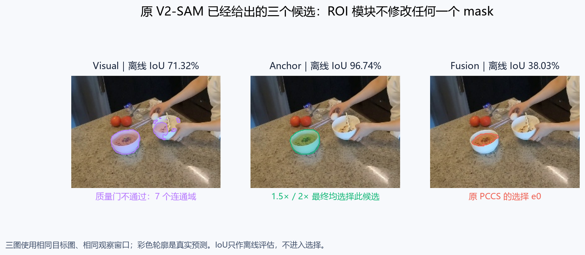
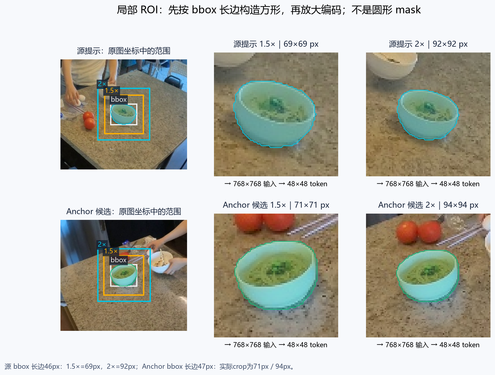
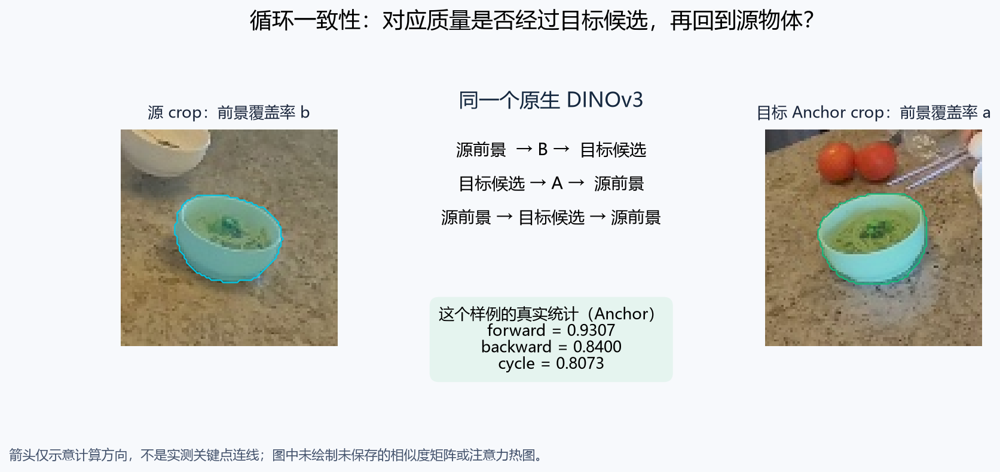
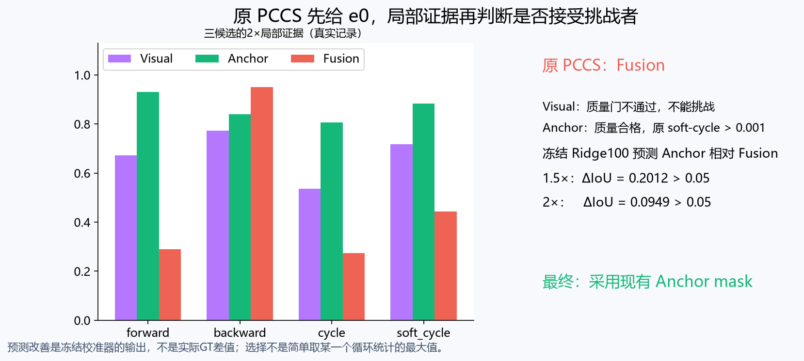
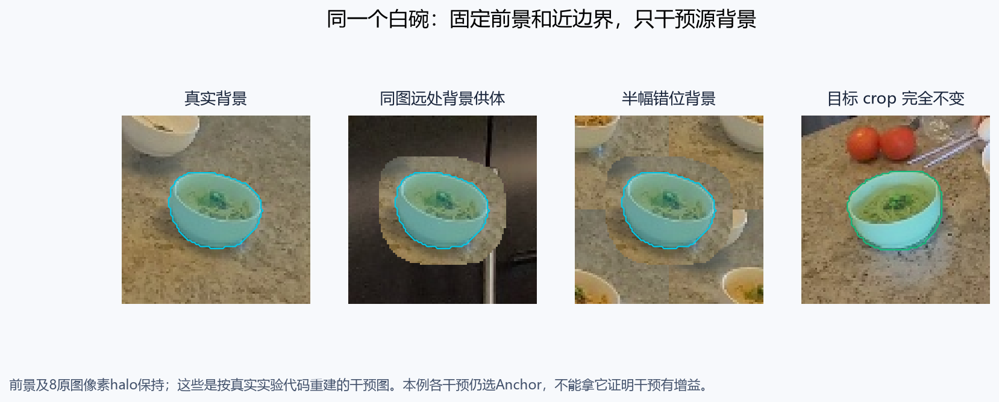

# 在原 PCCS 上加入局部视图循环证据：方法、来源与验证

本说明描述目前实际实现，暂称 **PCCS + Local-view Cycle Evidence（局部视图循环证据）**。这是工作名称，不代表已证明独立新颖性。最终分割仍来自原 V2-SAM 的 Visual / Anchor / Fusion 三个候选；增强的是 PCCS 判断哪一个候选更可信的证据。

> **Exo→Exo样本范围补充：本文“全量1094对”指既有人工作源mask筛选后构建集的全量，只有20个takes，不是整个官方Ego-Exo4D。** 原集是547个可信源提示各配同帧/异帧一条，79种label文字、96条take-scoped实例。现新增6534个不重复时序配对压力测试，仍沿用这些场景和标注，不是新增独立场景；扩大到更多takes还需要更多可信exo源mask。详情见[扩展协议](../pccs_exoexo_expand_20260917/PLAN.md)。

> **先区分数据范围：Exo→Ego的“70/72”是固定512对子集，旧O-MaMa的“53.9/56.6”是46515对全量。不存在同一测试从57涨到70的结果。** 子集原PCCS本身70.9748，ROI2×为72.1706（+1.1958）；旧好权重全量原PCCS53.8997，O-MaMa几何一致性56.6385（+2.7388）。57.1015是该旧全量另一个学习判断器对照。当前原生ROI全量须等完整结果，不将子集绝对分数与历史全量相减。方向差异诊断及参考方法调研见[RESEARCH.md](../pccs_method_research_20260917/RESEARCH.md)。

<!-- EXAMPLE:intro -->
## 贯穿全文的真实例子：同一只白碗，两个视角



**图1｜本文一直跟踪左图青色提示圈定的那只白碗。** 源图是 `gp01/3570.jpg`，目标图是 `gp04/3570.jpg`；均来自 Ego-Exo4D take `280ab94b-ebd0-4245-85a1-4cacd670588f` 的同步帧3570。这是 **Exo→Exo** 的已完成seed1样例，不是正在运行的Exo→Ego全量结果。目标图中有两只外观相似的碗，读下面每章时都可以回到这张图：输入只告诉模型“源图的这只碗”，要求它在另一视角找到对应区域。

这个样例为解释方法而在查看结果后挑选，是一个成功案例；不能代表平均效果。尤其是此前冻结的全图cycle在本例也选择Anchor，所以单凭这张图不能证明新增ROI优于旧cycle。全量/双seed与消融结论仍以统计表为准。图中mask和数值来自真实候选记录；展示时将1024×1024目标mask最近邻映射到960×540原图，原始hash已核对。颜色只帮助读图，不输入模型。

阅读顺序：图1看输入 → 图2看原候选 → 图3看crop → 图4看循环量 → 图5看选择 → 图6看科学性对照。机器可读样例依据见[example_evidence.json](figures/example_evidence.json)。
<!-- /EXAMPLE -->

## 1. 目前用的究竟是哪种上下文

当前较有效的版本是 **1.5× / 2× ROI 裁图后，重新用原 DINOv3 编码**，不是仅在全图特征上把 bbox 向外扩大100像素。两者的区别如下。

| 方案 | 区域如何取 | 特征如何得到 | 当前证据 |
|---|---|---|---|
| 固定100/150px整框或背景环 | 在预处理图像坐标中扩大bbox | 原有全图DINOv3特征加权池化 | 相对原生cycle额外收益很小，错误邻域对照未变差 |
| 当前局部ROI循环 | 取以物体bbox中心为中心、边长1.5/2倍bbox长边的方形crop | crop缩放到768×768，用同一DINOv3再次编码 | Exo→Exo两seed约+3.3点，接近O-MaMa点估计；仍有因果与统计边界 |

当前ROI既放大物体细节，也带入其周围像素。**不能把全部提升直接解释成“认识到了周围物体”。** 本模块没有物体检测器、邻居实例列表、类别标签或关系图；背景通过DINOv3的图像编码和匹配竞争影响前景特征。

<!-- EXAMPLE:ch1 -->
**用这只白碗理解“上下文”。** 图1中物体本身只有几十像素宽，周围还有台面、番茄、餐具及另一只碗。我们不会把它们自动标成一张“邻居关系图”。下面图3只是把含这只碗的真实图像局部放大再编码，使物体及周围像素共同参与特征形成；远处背景是否有用，要看图6的独立干预，不能靠肉眼指定某个番茄是涨点原因。
<!-- /EXAMPLE -->

## 2. 保留的原 PCCS 流程

1. 原 Visual、Anchor、Fusion 专家照常产生三个候选mask。原region sampler、正向提示、SAM解码、后处理都保持。
2. 原反向对应模块把目标候选中的点映射回源视角。PCCS根据回环支持、距离与mask质量等，得到原始选择 `e0`。
3. **在上述推理完成之后**，读取源提示mask与三个目标候选，构造附加局部视图。新增证据不反向修改候选mask或对应点。
4. 在原PCCS选择基础上，评估其他候选是否有足够可信的改善。没有合格挑战者、或预测改善未越过阈值时，返回 `e0`。

实际集成点是PCCSMetric中原选择之后的 `native_select`。实验将其完整metric选择与离线策略逐对象核对；清空测试GT指标字段不改变策略输出。注意原实现 `_count_points_in_mask` 实际检查mask的bbox内点数，本研究沿用并如实命名为原hard-vote信息，没有偷偷换成像素级判定。



<!-- EXAMPLE:ch2 -->


**图2｜先看原PCCS已经拿到了什么。** 紫色Visual覆盖了桌上的碗，也出现手中另一只碗的碎片，共7个连通域，未通过质量门；绿色Anchor较完整地覆盖桌上的目标碗；红色Fusion偏向碗内的一小部分。原PCCS本例选择Fusion（`e0`）。后面的局部模块不生成第四个mask，也不把Fusion边界“修好”，它只判断是否应改用现成的Anchor。

图中的离线IoU分别为71.32%、96.74%、38.03%。这些是实验后用GT计算的评估数，不是模型在选择时能看的分数。
<!-- /EXAMPLE -->

## 3. 局部视图怎么构造

对源提示mask和每个目标候选分别取bbox，令长边为 `L`。

```text
crop_side = min(image_width, image_height, max(32, ceil(scale * L)))
scale ∈ {1.5, 2.0}
```

方框以bbox中心为中心，越界时整体平移回图像内，确保完整前景仍在框中。若前景少于16像素或bbox长边超过图像短边，标记该局部视图无效；记录实际倍率与坐标。尺寸相同的边界饱和crop不是独立证据。

crop缩放到768×768，使用原backward matcher的ImageNet归一化、DINOv3 ViT-L/16权重与最后层归一化token。全图原PCCS分支保持原有按高度768、宽度取16倍数的比例处理。附加编码有额外开销，不是免费池化；原实验实测了编码视图数、局部处理时间和峰值显存。

mask按面积插值映射到token网格，保留一个patch内的前景占比。这样对小物体或边界混合patch不强制二值化。源码：本目录 `roi_views.py`、`roi_evidence.py`；它们与已冻结ROI实验按字节一致。

<!-- EXAMPLE:ch3 -->


**图3｜方框是图像窗口，碗的mask仍是不规则轮廓。** 本例源提示bbox长边46像素，因此1.5×方形crop为69×69，2×为92×92；Anchor在目标原图上的bbox长边47像素，对应71×71及94×94。两幅crop都放到同样的768×768输入，产生48×48个DINOv3 token。图中1.5×下的碗占画面更大，2×则留出更多背景，这也是为何不能把倍率差异只解释成context多少：物体的编码分辨率也变了。

源2×crop的原图范围是 `[708,370,800,462]`，目标Anchor为 `[276,304,370,398]`（x0,y0,x1,y1，右下边界不含）。每个候选都按自己的mask取框；Fusion的2×框是84×84，Visual因包含离散区域为220×220。不是先用GT选一块统一“正确ROI”再去比较候选，也不是把bbox向外固定加100像素。
<!-- /EXAMPLE -->

## 4. 局部循环证据的计算

令目标crop特征为 `F`，源crop特征为 `G`，每个token在通道维L2归一化；目标候选、源提示在patch上的前景覆盖率向量分别为 `a`、`b`。

```text
S = F @ G.T / 0.07
A = row_softmax(S)       # 目标token → 源token
B = row_softmax(S.T)     # 源token → 目标token

forward  = b.T @ B @ a / sum(b)
backward = a.T @ A @ b / sum(a)
cycle    = b.T @ B @ diag(a) @ A @ b / sum(b)
soft_cycle = 2 * forward * backward / (forward + backward)
```

`forward`衡量源前景的对应质量有多少落入目标候选；`backward`衡量目标候选有多少支持回到源前景；`cycle`要求经过目标候选后再回到源前景。这继承的是PCCS的循环一致性判断思想，将单点/硬计数补充成局部的软区域证据。

大mask在随机对应下也更容易“接住”概率质量，所以另计算面积校正的log-lift：

```text
lift_forward  = log(forward)  - log(mean(a))
lift_backward = log(backward) - log(mean(b))
lift_cycle    = log(cycle)    - log(mean(a) * mean(b))
```

均匀随机对应下以上lift为0。实现给log输入设1e-30下限、分母设1e-8保护。此外计算前景覆盖率加权池化特征的余弦，并输入视图有效性、源/目标实际倍率。**这些是软对应支持，不是经校准的真实物体匹配概率。**

<!-- EXAMPLE:ch4 -->


**图4｜把公式中的a、b落到这两张crop上。** 青色源碗在源patch网格上形成覆盖率向量b，绿色目标Anchor在目标网格上形成a；A、B是在两张完整crop的token之间算出来的softmax对应。`bᵀ B a`会累计“源前景token的对应是否落到目标候选”的支持，往返项进一步要求经过目标候选再回源前景。

本例Anchor的2×局部 `forward=0.9307`、`backward=0.8400`、`cycle=0.8073`。Fusion的backward反而更高（0.9505），但forward只有0.2898：一个偏小的区域可以很容易回到源物体，却未必覆盖源物体在目标中的完整对应。因此不能只比较某一个方向的数值。图4中的箭头是数学路径示意；本次没有保存完整token亲和矩阵，未绘制或捏造注意力热图。
<!-- /EXAMPLE -->

## 5. 如何与原PCCS一起决定最终候选

挑战者和原选择均有两部分信息：原PCCS的hard votes、回环距离、有无点、SAM预测IoU、面积、连通域数；以及上述局部证据。校准器输入为挑战者特征、原选择特征、差值及专家类型one-hot。

校准器是小型Ridge/HGB；当前1.5×主方案和2×关键对照均为 **Ridge alpha=100，阈值0.05，present准入门**。准入要求源提示有效、候选质量合格、与原选择mask不同、原全图soft-cycle>0.001。预测改善超过0.05才换候选，否则沿用原PCCS。

监督目标是TRAIN中 `IoU(challenger) - IoU(e0)`，按pair对象数与有效挑战者数加权。48个TRAIN takes拟合、16个不相交TRAIN takes校准，固定四折take OOF。源域搜索预先包含7个特征组×3种模型×2阈值×2种准入门，共84组；要求OOF/校准都正增益，再按校准选型。**专家曾见过TRAIN；该小判断器也用TRAIN标签拟合，因此方法不能称完全training-free。** 它不重训SAM专家或DINOv3，不使用测试GT选型。

原选型选出1.5×；2×是预先列出的次要对照。2×在目标上更好，不能事后改写为原实验的预选主方案。本次全量同时报告二者，保持文件SHA和阈值不变。

缺失ROI的行为也须准确：局部统计置零，并有validity标记；原PCCS测量仍能让校准器改选，并非“缺失ROI必锁回原选择”。已有事后强制回退敏感性审计，影响很小；历史算法没有因此事后修改。

<!-- EXAMPLE:ch5 -->


**图5｜本例到底怎样从Fusion换到Anchor。** 三个候选原hard votes都为1，不能靠这项区分。Visual质量不合格，被挡在挑战者准入门外；Anchor质量合格，原全图soft-cycle为0.3962，大于0.001，且与Fusion不是同一个mask，因此进入校准。

冻结的1.5×Ridge预测Anchor相对原Fusion的改善为0.2012；2×Ridge预测为0.0949，二者均超过0.05，所以都采用原先已有的Anchor mask。这里0.0949是**预测改善**，不是本例真实IoU差0.5871；不能把校准器分数当准确概率，也不是看到离线IoU96.74%后才选择Anchor。注意Visual在1.5×下即使有较高的离线预测改善，也因质量门不通过而不能挑战。
<!-- /EXAMPLE -->

## 6. 与 O-MaMa 的借鉴关系

O-MaMa提供的启发是：跨视角匹配不能只看孤立物体，周围区域及两视角信息可帮助消除外观歧义。其公开实现使用DINOv2描述符，bbox四边各外扩100预处理像素，在包括前景的整框池化context，再使用学习的cross-attention/投影头进行匹配。

本方案保留这一**“局部上下文有助于跨视角匹配”**的动机，但实现围绕自己的PCCS：

| 项目 | O-MaMa参考 | 当前原生PCCS增强 |
|---|---|---|
| 主干与权重 | DINOv2与O-MaMa学习头 | 原PCCS DINOv3；无O-MaMa头/权重 |
| 区域 | 外扩100px整框描述符 | 物体局部ROI重编码 |
| 对应判断 | 学习的跨注意力、投影后相似度 | 原PCCS循环逻辑 + 双向区域传输/软循环/面积校正 |
| 最终mask | 对候选做匹配 | 原PCCS三个候选，带原选择回退的挑战者判断 |
| 新拟合部分 | O-MaMa原训练模块 | 小型原PCCS置信校准器 |

因此它不是把O-MaMa网络直接替换PCCS，也不是O-MaMa的忠实复现。应在论文相关工作/动机中明确引用O-MaMa，而不把借鉴的上下文idea宣称为首次提出。是否足以成为论文方法贡献还需要文献对照和更充分验证，不能仅凭代码不同或涨点就下结论。

参考：官方仓库 https://github.com/Maria-SanVil/O-MaMa ，已核对的 `descriptors/get_descriptors.py` 和 `model/model.py`；原PCCS仓库 https://github.com/jaychempan/V2-SAM-O/tree/v2sam-pccs 。实验参考代码、审计commit和权重指纹见总报告及各manifest。

<!-- EXAMPLE:ch6 -->
**回到同一只白碗看借鉴边界。** O-MaMa给我们的启发是“源碗附近的视觉环境可能帮助区分目标图中相似的碗”。这里实际实现的图3→图4→图5路径，仍使用原PCCS的DINOv3、往返一致性和原候选回退：放大白碗所在局部，算局部区域循环支持，再决定是否替换Fusion。没有在这一步加载O-MaMa的DINOv2、cross-attention或投影头。

白碗例子说明的是数据怎样经过模块，不能凭这一例宣称方法独创、context因果有效或已追平O-MaMa。相关工作引用和整体对照仍然需要保留。
<!-- /EXAMPLE -->

## 7. 最佳Exo→Ego权重与历史O-MaMa核对

| 专家 | 已确认版本 | 文件SHA256 |
|---|---|---|
| Visual | 用户修正版e19 | fd2e1b8f342c4468b45c962c61d4c914b9f6d71b6c6085014fb9a3ed2924b65f |
| Fusion | 用户修正版e20 | 8373b17180c198898fe9f9e39d09fe72991150ce3053b207b19e81986c60cab1 |

这两份文件与HF `Travor278/V2-SAM@8b8310e9ee13023cb8711c2417e18cc7361dc3aa` 及实验日记核对过；本次启动时再次完整hash验证。这里“最佳”指用户此前确认并上传的这组版本，不代表本次又做了一遍所有训练epoch的搜索。

**此前O-MaMa确实用这组好权重跑过Exo→Ego全量**：`pccs_corrected_exoego_20260916`，46515对、109253对象、295takes，原PCCS53.8997，几何一致性O-MaMa56.6385，+2.7388点，95%区间[1.9556,3.6700]。manifest专家SHA、full_runtime、run_stage预检与完整结果/回执相互一致；另有更早作者权重实验，不能混在一行。

旧全量的候选运行/种子与当前不同，以上是历史基准，不是本轮同候选差值。当前原生ROI的Exo→Ego此前只有512对子集双seed；本次才运行46515对全量双seed，完成前不能声称已验证全量。完整权重核验机读证据将保存 `weight_audit.json`。

<!-- EXAMPLE:ch7 -->
**这个样例的模型来源也与上表对应。** 虽然图1是两个外部视角，本研究没有单独Exo→Exo训练权重，因此沿用这组修正后的Exo→Ego专家生成图2候选。图中好坏差异不能与另一组作者权重的结果混比。图1的Exo→Exo成功例子更不能替代本次46515对Exo→Ego全量验证。
<!-- /EXAMPLE -->

## 8. 已有结果与本次补充的科学性验证

已有2×对照：Exo→Exo全量两seed分别+3.3101/+3.2772点，接近各自同bank O-MaMa +3.3790/+3.4706；Exo→Ego512对子集为+1.1958/+1.0748点。源域预选1.5×同样保持正增益。相对原PCCS的区间为正不等于与O-MaMa统计等效，也不保证新数据必涨点。

已完成：固定像素/倍率池化、纯背景环/整框、全图cycle同容量对照、局部有背景/前景-only、相同候选准入、两种子冻结复验、实际metric/离线一致、GT不进入选择、零IoU保留、encoder/缓存同源、额外计算量与缺失视图审计。此前错误邻域池化对照失败也保留在总报告。

本次新增 **固定模型、固定候选的自然背景干预**：目标图与目标mask不动；源前景RGB、mask、crop坐标/尺寸及8原图像素边界带逐像素保持，只替换源crop中更远的背景。

- 原图/sham路径：重新提取真实crop，必须复现旧特征和选择，排除预处理差异。
- 同图远处背景：在9个网格位置选源mask重叠最少、离物体最远的自然patch，作为远背景供体；记录供体坐标、前景重叠与实际替换比例。
- 背景错位：crop平移半边长后仅拷贝保护区之外像素，保留自然纹理，破坏邻域排列。

这两种干预减少了仅用均值灰背景的局限，但仍可能有拼接边缘、分布变化；错位供体也可能带入物体纹理，不能称完美纯背景控制。真实背景优于干预至多支持“背景兼容性对当前模型有作用”，不能单凭此证明具体邻居语义的因果关系。无可编辑背景的样本保留并记录，不按结果删掉。

在Exo→Exo1094对及既有Exo→Ego512对分别做配对评估，用同一冻结1.5/2×校准器，不为干预重训练；这些是描述性机制对照。全量评估另用两seed分别报告，不将seed当新增takes合并样本量。所有实验遵守相同新frame指标：每pair先对对象平均，再pair等权平均，保留零值；区间采用10000次take-cluster bootstrap。

<!-- EXAMPLE:ch8 -->


**图6｜不动白碗，只改它旁边较远的像素。** 四图依次为真实源2×crop、同图远处供体背景、半幅错位背景、完全不变的目标crop。源前景和8原图像素halo保持原RGB；图上的青色透明叠加仅是显示标记，不参与模型。图是用科学消融的同一代码从原图和mask重建的，不是生成式合成样图。

**本例是重要的反面提醒：三个背景条件下，1.5×和2×都仍选Anchor。** 因此不能说“换背景后这只碗立刻匹配失败”，更不能把图6用作单例因果证明。它展示的是如何干预；真实背景平均优于某些干预的证据，来自前面列出的完整1094对/512对配对统计。旧全图cycle在这只碗上也选Anchor，故本例同样不能证明ROI对旧cycle的增益。样例没有替代负对照或全量表。
<!-- /EXAMPLE -->

## 9. 复现入口及当前状态

- 全量启动/分片/精确权重核验：`prepare.py`、`controller.py`、`worker.py`。
- 原生方法：`roi_views.py`、`roi_evidence.py`、`roi_policy.py`、`native_bridge.py`。
- 自然背景实验：`science_views.py`、`science_worker.py`、`science_evaluate.py`。
- 全量冻结指标：`summarize.py`，输出 `full1_results.json` / `full2_results.json` 与可独立复算的compact对象记录。
- 总报告：`../pccs_gain_full_20260915/FINAL_REPORT.md`；本说明不替代所有数值日志。

本次全量与自然背景控制的实际进度见下节；所有正负结果均记录。1.5×历史主方案身份、2×关键对照身份、模型文件与阈值保持冻结。

<!-- EXAMPLE:ch9 -->
### 按同一例子核对复现

`figures/example_evidence.json` 保存这只白碗的ID、真实候选hash、ROI坐标、原始局部统计、校准器预测和各干预选择；`render_walkthrough.py`生成六张解释图。原图及压缩mask留在私有`walkthrough/`目录，展示图按本次文档请求单独导出；未把未保存的注意力、关键点或GT轮廓画成真实输出。

案例图跟随文档放在`figures/`相对路径下，在本地与GitHub中都可显示。后续自动更新全量结果只更新下一节，保留本案例图文说明。
<!-- /EXAMPLE -->

<!-- CURRENT_VALIDATION_RESULTS -->

## 10. 本次验证进度与结果

本次平台启动已再次完整核验Visual e19/Fusion e20的字节数及SHA，并确认历史O-MaMa全量使用同组权重；机器可读证据：`weight_audit.json`。

自然背景控制已完成，以下均为同一候选、同一冻结模型的描述性配对比较。真实图重放需保持原始特征/选择一致。

| 方向/尺度 | 真实背景 IoU | 远背景 IoU | 错位背景 IoU |
|---|---:|---:|---:|
| science_exo2exo/local15 | 41.7688 | 41.4829 | 41.2802 |
| science_exo2exo/local20 | 42.3292 | 41.6638 | 41.8963 |
| science_exo2ego/local15 | 72.0801 | 72.0162 | 71.9349 |
| science_exo2ego/local20 | 72.1706 | 72.0892 | 71.8289 |

| 配对比较 | 真实−干预（点） | 95%区间 |
|---|---:|---|
| science_exo2exo/real minus far local15 | +0.2859 | [0.0573, 0.5548] |
| science_exo2exo/real minus rolled local15 | +0.4886 | [0.0089, 0.9218] |
| science_exo2exo/real minus far local20 | +0.6654 | [0.3186, 0.9870] |
| science_exo2exo/real minus rolled local20 | +0.4329 | [-0.3130, 1.0509] |
| science_exo2ego/real minus far local15 | +0.0640 | [-0.0423, 0.1976] |
| science_exo2ego/real minus rolled local15 | +0.1453 | [0.0188, 0.2982] |
| science_exo2ego/real minus far local20 | +0.0814 | [-0.0041, 0.1869] |
| science_exo2ego/real minus rolled local20 | +0.3417 | [-0.0187, 0.7604] |

本对照仍受自然patch拼接、空间错位和模型分布变化限制，不能单独证明具体邻居语义的因果作用。

自然背景控制的解读：Exo→Exo2×真实背景比远处供体高0.6654点，区间[0.3186,0.9870]；支持局部背景兼容性影响当前模型。1.5×远处供体差也为正，2×错位对照跨零。Exo→Ego效果更弱，多数区间跨零，不能推广为所有方向/尺度均显著。

真实图重放逐项特征误差为0。远供体不是完美纯背景：2×时Exo→Exo30个、Exo→Ego130个供体patch与源mask有重叠，全部保留；缺失ROI的4/17个对象也保留。源前景与8像素halo严格保持，平均实际改动比例及供体信息详见science_audit.json。

全量seed1：46515对、109253对象、295takes。

| 方法 | IoU | 相对本轮原PCCS增益（点） | 95%区间 |
|---|---:|---:|---|
| baseline | 53.9195 | +0.0000 | [0.0000, 0.0000] |
| frozen_cycle | 55.0587 | +1.1392 | [0.9051, 1.3849] |
| primary | 56.3794 | +2.4599 | [2.0762, 2.8777] |
| local20_matched | 56.4337 | +2.5142 | [2.1173, 2.9451] |
| global_matched | 55.3469 | +1.4275 | [1.0601, 1.8497] |
| object20_matched | 55.4578 | +1.5384 | [1.1901, 1.9384] |

同候选的机制/方法对照（描述性比较，未按测试结果重新选型）：

| 比较 | IoU差（点） | 95% take区间 |
|---|---:|---|
| primary minus frozen_cycle | +1.3207 | [1.0066, 1.7158] |
| local20_matched minus frozen_cycle | +1.3750 | [1.0537, 1.7900] |
| local20_matched minus object20_matched | +0.9758 | [0.8094, 1.1420] |
| global_local20_matched minus global_object20_matched | +0.9268 | [0.7631, 1.0948] |

在同一次全量运行中重新按既有512配对成员分组；不是重新挑选高分样本。

| 范围 | 配对数 | 原PCCS | 1.5× | 2× | 三候选GT oracle |
|---|---:|---:|---:|---:|---:|
| 全量 | 46515 | 53.9195 | 56.3794 | 56.4337 | 63.0609 |
| 此前512对子集成员 | 512 | 70.9748 | 72.0801 | 72.1706 | 77.6474 |
| 其余配对 | 46003 | 53.7297 | 56.2046 | 56.2585 | 62.8986 |

GT oracle只用于事后诊断，不进入推理/拟合/阈值选择。全量和子集的基线差异来自样本范围；不能据此证明具体难度因素。前景-only对照同时改变输入背景和表征分布，与自然背景干预合看，不能将全部差值归于邻居语义。

全量seed2：待完成，尚无46515对完整结果。

扩展Exo→Exo时序压力测试已完成：新增6534个不重复配对，原PCCS41.3130，冻结1.5×主方案45.0837（+3.7706点），2×对照45.2391（+3.9260点），同候选O-MaMa43.9262（+2.6131点）。原主方案对O-MaMa区间跨零，2×对照的描述性差区间为[0.1774,2.6580]，不改变事前主次身份。

该扩展只有19个旧take，不是新增场景泛化；它没有替代仍在运行的Exo→Ego46515对全量验证。完整结果见总报告§16及扩展目录的validation.json。
