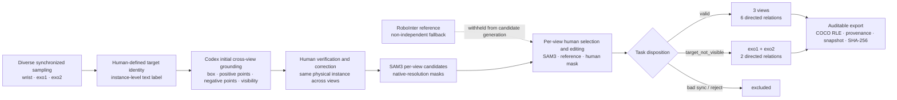

# Human-Verified Cross-View Data Engine

> Status: wording approved and locked on 2026-08-25. This document is the
> canonical description for the paper, dataset README, and pipeline figure.

## 1. 一句话概括

我们构建的不是一条“模型自动生成伪标签”的流水线，而是一套以物理实例身份为核心的多视角数据引擎：**人类定义目标物体，Codex 在三个同步视角中生成初始空间提示，人类验证并修正跨视角 grounding，SAM3 生成逐视角候选 mask，人类再按视角选择、修订并记录最终 mask 来源，最后依据目标可见性构造可审计的跨视角关系。**

```text
Diverse synchronized sampling
  → Human-defined target identity
  → Human-verified cross-view target grounding
  → Codex-guided SAM3 candidate generation
  → Per-view provenance-aware human selection
  → Visibility-aware relation construction
  → Auditable export and validation
```

## 2. 角色与职责边界

这套流程有意将语义定义、空间定位、像素分割和最终监督信号决策解耦。

| 参与者 | 核心职责 | 不负责的内容 |
|---|---|---|
| Human annotator | 定义目标物体及其物理实例；验证并修正跨视角 grounding；逐视角选择或编辑最终 mask；决定样本状态 | 不把任意自动候选无条件当作 ground truth |
| Codex / Sol | 根据三视角原图、操作指令和人工目标定义，完成实例消歧并生成逐视角 box、positive points、negative points、可见性判断和详细描述 | 不直接决定最终 mask；生成候选时不读取 RoboInter official mask |
| SAM3 | 根据 target text、box 和正负点，在原生分辨率上生成逐视角像素级候选 mask | 不决定跨视角物理实例，不决定样本是否进入数据集 |
| RoboInter reference | 在人工复核阶段提供非独立的上游参考或 fallback | 不进入 Codex/SAM3 独立候选生成路径 |
| Deterministic exporter | 根据人工选择解析最终 mask、生成关系、保存 provenance 并执行完整性审计 | 不对冲突、缺失或模糊选择进行静默猜测 |

## 3. 详细数据生成流程

### 3.1 多样化采样与同步视图构建

我们首先从 RoboInter 中的 DROID 子集采样真实机器人操作数据。每个 source moment 包含同一操作时刻的三个相机视角：机器人腕部视角 `wrist/ego`，以及两个外部视角 `exo1` 和 `exo2`。采样不仅追求数量，还主动增加场景、轨迹、任务、目标类别、外观、尺度、遮挡程度和观察角度的多样性。

三视角图像在进入后续步骤前必须满足同步和可加载要求。原始 PNG 保持原生分辨率和原始字节，不因模型推理而覆盖、缩放或重新编码。无法建立可靠同步关系、源图像损坏或目标时刻本身含糊的 source 会被显式记录，而不是被静默跳过。

### 3.2 Human-defined target identity：人工定义目标物体

标注者同时观察三个视角和机器人操作指令，选择当前 source moment 中一个具有明确跨视角身份的目标。这里定义的是**同一个物理实例**，而不仅是一个语义类别。

当画面中存在多个同类物体时，目标文本需要提供足够的区分信息，例如颜色、材质、左右位置、打开或关闭状态、是否被夹爪抓住，以及与邻近物体的关系。与其只写 `cup`，更准确的描述是 `the yellow cup held by the gripper`；与其只写 `cabinet door`，更准确的描述是 `the right cabinet door that is currently open`。

这一步建立后续流程不可随意改变的 target identity。Codex、SAM3 和人工最终选择都必须围绕该物理实例进行，不能在不同视角中切换到另一个同类物体。

### 3.3 Human-verified cross-view target grounding：人类验证的跨视角定位

Codex / Sol 在不知道 official mask 的条件下读取三视角原图、操作指令和人工目标文本，并为每个视角生成：

- 目标物体的详细描述；
- normalized bounding box；
- 位于目标内部的 positive points；
- 位于夹爪、背景或相邻干扰物上的 negative points；
- 当前视角中的目标可见性判断；
- 三视角是否对应同一物理实例的语义判断。

随后由人类检查并在需要时修正这些 grounding 结果。人工验证重点不是“这个区域看起来像某个类别”，而是确认三个视角中的区域是否确实属于同一个物理实例。检查内容包括：

- 同类别相邻物体是否被混淆；
- box 是否覆盖整堆物体而不是单个目标；
- positive points 是否位于目标内部；
- negative points 是否正确标记夹爪、背景和 distractors；
- 柔性、透明、反光或低纹理物体是否被正确定位；
- 柜门、鞋子、瓶子等重复实例是否在不同视角中保持一致；
- 目标是否在某个视角中真实可见。

因此，本阶段应称为 **human-verified cross-view target grounding**，而不是 `human-generated grounding`：Codex 生成初始 box 和 points，人类对物理实例身份、空间位置和跨视角一致性承担最终责任。

### 3.4 Codex-guided SAM3 candidate generation：条件化候选生成

SAM3 对三个视角分别运行，并同时使用 target text、bounding box、positive points 和 negative points。在存在紧邻同类物体、夹爪遮挡或复杂背景时，负点用于明确排除不属于目标的区域，避免退化成 box-only 分割或把多个实例合并成一个 mask。

三个视角的候选 mask 是 view-specific 的，但共享同一个人工定义且人工验证的 target identity。SAM3 仅提供候选，不直接产生最终 ground truth。RoboInter reference mask 不进入此路径，从而保证 Independent Codex + SAM3 candidate 不会因为读取上游答案而发生 mask leakage。

候选生成后，系统计算辅助 QA 信号，包括正负点与 mask 的空间关系、mask 面积、连通分量、零散散点、centroid drift、目标可见性和三视角实例一致性。这些信号用于排序和发现可疑样本，但不会替代人工决策。

### 3.5 Per-view provenance-aware human selection：逐视角选择和修订

Label Studio 同时展示三视角原图、Independent Codex + SAM3 candidate、RoboInter reference/fallback、候选 overlay 和 QA 信息。标注者不是为整个 task 统一选择一个来源，而是对 `wrist`、`exo1`、`exo2` **分别**决定最终 mask。

| 最终来源 | 使用条件 | 导出 provenance |
|---|---|---|
| Independent Codex + SAM3 | 候选实例正确、边界完整，优于或不需要上游参考 | `independent_sam3` |
| SAM3 + human addition | SAM3 主体正确，但人工补充了缺失区域 | `independent_sam3 + human_addition` |
| RoboInter reference | 上游参考明显优于独立候选，作为非独立 fallback | `official_fallback` |
| Human annotation | 两种候选均不适用，由人工结果定义最终 mask | `submitted_annotation_union` |

同一个 task 的三个视角可以使用不同来源，例如：

```text
wrist → human-edited SAM3
exo1  → independent SAM3
exo2  → RoboInter fallback
```

人工编辑的解析规则也被显式定义：如果人工在候选基础上增加新 region，最终 mask 为 base 与所有新增区域的像素级并集；如果人工修改了候选本身对应的同一 region，则修改后的完整 mask 替换原 base，使擦除操作能够保留；如果未选择 SAM3 或 RoboInter，则使用人工提交区域的并集。所有操作均在原生图像尺寸上完成。

### 3.6 Visibility-aware relation construction：基于可见性的关系构造

人工还需要为整个 task 指定状态。该状态和逐视角 mask 来源是两个不同层级的决策。

#### `valid`

目标在 `wrist/ego`、`exo1` 和 `exo2` 中均可可靠识别和分割。该 task 导出三个视角以及六条有向关系：

```text
ego  → exo1    ego  → exo2
exo1 → ego     exo2 → ego
exo1 → exo2    exo2 → exo1
```

#### `target_not_visible`

目标在 wrist/ego 中不可见或无法可靠辨认，但在两个外部视角中仍然可见。系统不会伪造 ego mask，也不会丢弃仍有效的外部视角 correspondence，而是仅导出：

```text
exo1 → exo2
exo2 → exo1
```

#### `bad_sync_or_source` / `reject`

三视角不同步、源数据异常、目标身份含糊、标注质量无法保证或属于重复样本时，整个 task 被排除，不生成训练或评测关系。

这种设计显式区分了“目标真实不可见”“候选分割质量差”和“源数据无效”，避免把不同失败模式混为一类。

### 3.7 Auditable export and validation：可追溯导出

导出器将人工选择解析成逐视角最终 mask，并保存 target text、source identity、trajectory ID、原图 SHA-256、压缩 COCO RLE、mask 面积与尺寸、逐视角 provenance、人工状态、模型预测记录和冻结的 Label Studio snapshot。

在接受一个 snapshot 前，系统会：

- 解码每个 RLE 并验证尺寸、非空性和面积；
- 检查所有关系引用的图片是否存在；
- 检查 `valid` 和 `target_not_visible` 对应的视角与关系数量；
- 拒绝同一视角同时选择 SAM3 和 RoboInter 的冲突情况；
- 拒绝缺失状态、缺失 required mask 或存在 active draft 的导出；
- 验证有向关系的对称性和数量；
- 为输出文件生成 SHA-256 校验清单；
- 先在 staging 目录构建，全部验证通过后再原子封存。

无法确定的情况进入显式 issue/quarantine，而不是由导出器猜测。

## 4. 当前锁定快照的结果

该流程在当前锁定的 Project 2 snapshot 上处理了 1,500 个已提交 task：

| 项目 | 数量 |
|---|---:|
| accepted pairs | 1,396 |
| `valid` pairs | 1,081 |
| `target_not_visible` pairs | 315 |
| rejected / bad-source pairs | 104 |
| directed relations | 7,116 |
| exported view masks | 3,873 |
| unresolved export issues | 0 |
| active drafts | 0 |

这些数字属于当前锁定版本；流程性描述不依赖具体数量，未来 snapshot 更新时只需重新计算本节统计。

## 5. Novelty 与普通自动标注流程的差别

1. **Identity-first，而不是 category-first。** 人类首先定义同一物理实例，然后模型才执行跨视角定位和分割，降低同类多实例之间的错误匹配。
2. **人机职责解耦。** Codex 负责语义推理和初始空间提示，SAM3 负责像素候选，人类负责身份验证、边界修订和最终监督信号选择。
3. **独立候选避免 reference leakage。** Codex+SAM3 在不读取 RoboInter official mask 的情况下生成独立候选，reference 只在人工选择阶段作为非独立 fallback 出现。
4. **Per-view selection，而不是 task-level winner-takes-all。** 三个视角可以采用不同 mask 来源，保留不同相机下真实存在的质量差异。
5. **选择差异本身被记录。** 系统不把 SAM3、reference 和人工结果预先融合成无法区分的标签，而是保留逐视角 provenance。
6. **显式建模不可见性。** `target_not_visible` 保留有效的 exo↔exo 数据，同时避免制造不存在的 ego ground truth。
7. **人工修订是结构化信号。** 系统区分完整 base 编辑和新增区域，并以 replacement 或 boolean union 的确定性规则导出。
8. **最终产品是可审计关系数据。** 每条关系可以追溯到原始图像、target identity、Codex grounding、SAM3 candidate、人工选择和导出校验。

## 6. 可直接用于论文的中文描述

我们提出了一套 identity-first、human-verified 且 provenance-aware 的多视角数据引擎，用于从真实机器人操作视频中构建跨视角物体分割关系。对于每个同步的 wrist、exo1 和 exo2 时刻，标注者首先根据三视角图像和操作指令定义一个明确的目标物理实例及其细粒度文本描述。随后，Codex 在不访问上游 official mask 的条件下，对三个视角分别生成目标 box、positive/negative points、可见性判断和实例级描述；人工进一步检查并修正这些结果，保证不同视角中的 grounding 对应同一个物理对象。SAM3 使用经验证的文本和空间提示，在原生分辨率上独立生成逐视角候选 mask。候选不会被直接视为 ground truth，而是在 Label Studio 中与 RoboInter reference 一同交由人工逐视角比较。标注者可独立选择 SAM3、非独立 reference 或人工标注，并可通过完整编辑或增量区域对候选进行修订；导出器以确定性的 replacement/union 规则解析最终 mask，同时保留其来源。最后，系统根据人工状态构造关系：`valid` 样本产生三个视角间的六条有向关系，`target_not_visible` 样本仅保留两条 exo↔exo 关系，而同步错误或身份含糊的样本被排除。该设计将目标定义、跨视角 grounding、像素候选生成和最终监督信号选择解耦，既避免了 reference leakage 和同类实例错配，也显式保留了视角可见性、人工修订及 mask 来源差异。

## 7. Paper-ready English description

### Data Engine Pipeline

We develop an identity-first, human-verified, and provenance-aware data engine for constructing cross-view object segmentation relations from real-world robot manipulation data. Each source moment contains synchronized wrist/ego, exo1, and exo2 observations. A human annotator first defines a target as a specific physical instance, rather than merely assigning a category name, and provides a discriminative text description using attributes such as color, location, state, and interaction with the gripper. This target identity is fixed throughout the remaining pipeline.

Given the three raw views, the manipulation instruction, and the human-defined target identity, Codex produces an initial view-specific grounding consisting of a detailed target description, a normalized bounding box, positive points, negative points on distractors, and a visibility decision. Humans then inspect and correct these grounding results to ensure that all visible regions refer to the same physical instance across cameras. We therefore characterize this stage as **human-verified cross-view target grounding**, rather than fully human-generated grounding. Importantly, the upstream RoboInter reference masks are withheld from this path, preventing reference-mask leakage into the independently generated candidates.

SAM3 consumes the verified text and spatial prompts and generates an independent mask candidate for each view at the native image resolution. Boxes constrain the search region, positive points anchor the target interior, and negative points explicitly suppress the gripper, background, and nearby same-category distractors. Automated checks measure prompt-mask consistency, mask area, connected components, centroid drift, visibility, and cross-view identity consistency. These signals prioritize suspicious cases for inspection but never determine the final ground truth.

During review, the raw images, Independent Codex + SAM3 candidates, RoboInter references, overlays, and QA signals are displayed together in Label Studio. Selection is performed independently for each view: a reviewer may accept the independent SAM3 candidate, use the non-independent RoboInter reference as a fallback, or provide a human annotation. A task may therefore combine different sources across cameras. Human additions to an accepted base are merged by pixelwise union, whereas an edited region retaining the prediction region identity replaces the base so that intentional erasures are preserved. The final per-view provenance is retained rather than collapsing all sources into an indistinguishable label.

Task-level disposition is separated from per-view mask selection. A `valid` task contains reliable wrist, exo1, and exo2 masks and produces all six directed cross-view relations. If the target is not reliably visible in the wrist view but remains visible in both external cameras, the task is labeled `target_not_visible` and contributes only the two exo-to-exo directions. Tasks with invalid synchronization, ambiguous identity, irrecoverable source problems, or insufficient annotation quality are rejected. This visibility-aware construction avoids fabricating an ego-view mask while preserving useful external-view correspondence.

Finally, a deterministic exporter converts the reviewed tasks into relation records with compressed COCO RLE masks and preserves the source identity, target text, trajectory metadata, image hashes, mask provenance, human decision, predictions, and a frozen Label Studio snapshot. Every emitted RLE is decoded and checked against the source dimensions and area; relation symmetry, view availability, file existence, draft state, and checksum coverage are also verified. Ambiguous or conflicting selections are quarantined instead of being silently resolved. The result is not a collection of opaque pseudo-labels, but an auditable supervision set in which each cross-view relation can be traced through human target definition, Codex grounding, SAM3 candidate generation, human selection, and deterministic export.

### Core novelty

The novelty does not lie in merely combining Codex and SAM3. It lies in the design of an identity-first data engine that separates semantic target definition, cross-view grounding, pixel-level candidate generation, and final supervision selection. The pipeline produces candidates independently of the upstream reference, verifies physical-instance correspondence across views, supports different mask sources for different cameras, models target invisibility explicitly, and retains every human correction and source decision as structured provenance.

## 8. Mermaid 流程图草稿



## 9. 流程图生成 Prompt

### 9.1 推荐英文 Prompt

```text
Create a publication-quality academic pipeline diagram for a robotics and computer vision paper. Use a clean horizontal 16:9 layout, white background, flat vector style, thin dark-gray arrows, consistent sans-serif typography, and a restrained palette: blue for human actions, purple for Codex reasoning, orange for SAM3 segmentation, gray for the upstream reference, green for accepted outputs, and red only for rejected samples. Do not use photorealistic decoration, gradients, 3D effects, or unnecessary icons.

Title: “Human-Verified Cross-View Data Engine”.

Show the main pipeline from left to right:

1. “Diverse Synchronized Sampling” — depict three aligned image cards labeled “Wrist / Ego”, “Exo1”, and “Exo2”. Add the subtitle “same manipulation moment”.

2. “Human-Defined Target Identity” — show a human annotator selecting one specific physical object and writing an instance-level description such as “the yellow cup held by the gripper”. Emphasize “same physical instance, not only category”.

3. “Human-Verified Cross-View Target Grounding” — split this stage into two connected substeps. First, a purple Codex block generates “target text + box + positive points + negative points + visibility” independently for each view. Second, a blue human verification block checks and corrects the grounding so that all three views refer to the same physical instance. Show a small correction loop between Codex output and human verification.

4. “Codex-Guided SAM3 Candidate Generation” — show SAM3 receiving verified text, boxes, positive points, and negative points, then producing one native-resolution candidate mask for each view. Add a small label: “independent candidate; no reference-mask leakage”.

5. “Per-View Provenance-Aware Human Selection” — display three candidate columns, one per camera. For each view, show that the reviewer may independently select one of three sources: “Independent SAM3”, “RoboInter Reference”, or “Human Annotation / Edit”. Also show “base replacement or pixelwise union” and “provenance retained”. The three cameras are allowed to use different sources.

Draw the “RoboInter Reference” as a separate gray side branch that enters only at the human selection stage. Use a dashed blocked connection or shield symbol to make clear that it is withheld from Codex and SAM3 candidate generation.

6. “Visibility-Aware Relation Construction” — use a decision diamond with three branches:
   • “valid” → “3 views, 6 directed relations”;
   • “target_not_visible” → “Exo1 ↔ Exo2 only, 2 directed relations”;
   • “bad sync / reject” → “excluded”.

7. “Auditable Export and Validation” — show compressed COCO RLE, per-view provenance, frozen Label Studio snapshot, relation checks, and SHA-256 checksums. End with a compact dataset icon labeled “Traceable Cross-View Supervision”.

Add a bottom highlight band titled “Novelty” with four short phrases:
“identity-first”, “human-verified grounding”, “independent candidate generation”, and “per-view provenance-aware selection”.

Keep the information hierarchy clear and readable at paper-column scale. Use exact wording for all major stage titles. Do not imply that SAM3 produces final ground truth automatically, do not show the RoboInter reference entering Codex or SAM3, and do not merge per-view selection into a single task-level model choice.
```

### 9.2 中文 Prompt

```text
生成一张用于机器人与计算机视觉论文的高质量学术流程图。画面为横向 16:9，白色背景，扁平矢量风格，使用细灰黑色箭头和统一的无衬线字体。颜色保持克制：蓝色表示人工操作，紫色表示 Codex 语义推理，橙色表示 SAM3 分割，灰色表示上游 reference，绿色表示接受的数据，红色只用于被排除的数据。不要使用写实装饰、渐变、3D 效果或无关图标。

标题为“Human-Verified Cross-View Data Engine”。

从左到右绘制以下步骤：

1. “Diverse Synchronized Sampling”：绘制三张同步图像卡片，分别标为“Wrist / Ego”“Exo1”“Exo2”，副标题为“same manipulation moment”。

2. “Human-Defined Target Identity”：绘制人工标注者从三视角中选择一个明确的物理实例，并写下实例级描述，例如“the yellow cup held by the gripper”。突出“same physical instance, not only category”。

3. “Human-Verified Cross-View Target Grounding”：拆成两个相连的小步骤。首先由紫色 Codex 模块为各视角生成“target text + box + positive points + negative points + visibility”；然后由蓝色人工模块检查和修正 grounding，确保三个视角对应同一个物理实例。Codex 输出和人工验证之间画一个小型修正回路。

4. “Codex-Guided SAM3 Candidate Generation”：SAM3 接收经过验证的文本、box、正点和负点，为三个视角分别生成原生分辨率 mask 候选。标注“independent candidate; no reference-mask leakage”。

5. “Per-View Provenance-Aware Human Selection”：按三个相机分别绘制选择列。每个视角均可独立选择“Independent SAM3”“RoboInter Reference”或“Human Annotation / Edit”，并显示“base replacement or pixelwise union”和“provenance retained”。明确允许三个视角使用不同来源。

将“RoboInter Reference”绘制为独立的灰色侧分支，只进入人工 selection 阶段。通过虚线阻断箭头或盾牌符号强调 reference 不进入 Codex 和 SAM3 的独立候选生成路径。

6. “Visibility-Aware Relation Construction”：使用决策菱形和三个分支：
   • “valid” → “3 views, 6 directed relations”；
   • “target_not_visible” → “Exo1 ↔ Exo2 only, 2 directed relations”；
   • “bad sync / reject” → “excluded”。

7. “Auditable Export and Validation”：绘制 compressed COCO RLE、逐视角 provenance、冻结的 Label Studio snapshot、关系完整性检查和 SHA-256 checksums。最终输出图标标注为“Traceable Cross-View Supervision”。

图底部增加一个“Novelty”强调带，包含四个短语：“identity-first”“human-verified grounding”“independent candidate generation”“per-view provenance-aware selection”。

保证信息层级清楚，在论文单栏或双栏缩放后仍然可读。主要阶段标题必须使用以上精确措辞。不要暗示 SAM3 自动产生最终 ground truth；不要让 RoboInter reference 进入 Codex 或 SAM3；不要把逐视角 selection 画成整个 task 只选择一个模型的决策。
```

### 9.3 Negative Prompt

```text
photorealistic scene, decorative robot illustration, dark background, gradient,
3D render, glossy UI, excessive shadows, crowded text, tiny unreadable labels,
comic style, inaccurate arrows, automatic ground-truth claim, reference mask fed
into Codex, reference mask fed into SAM3, one global mask-source choice for all
views, missing target_not_visible branch, invented metrics, invented model scores
```

## 10. Figure Caption

**English.** Overview of the human-verified cross-view data engine. Humans first define a target physical instance. Codex independently grounds that identity in synchronized wrist and external views, after which humans verify and correct the cross-view grounding. SAM3 generates per-view candidates from the verified text, boxes, and positive/negative points. Reviewers then select or edit the final mask independently for each view using the independent candidate, the non-independent RoboInter reference, or a human annotation. Visibility-aware task disposition determines whether a sample contributes six tri-view directions, two exo-only directions, or is excluded. All final relations retain mask provenance and pass deterministic export and integrity checks.

**中文。** 人工验证的跨视角数据引擎概览。人工首先定义明确的目标物理实例；Codex 在同步的 wrist 和外部视角中独立生成初始 grounding，随后由人工检查并修正跨视角身份与空间定位；SAM3 根据验证后的文本、box 和正负点生成逐视角候选。标注者再对每个视角独立选择或编辑最终 mask，其来源可以是独立候选、非独立 RoboInter reference 或人工标注。基于可见性的 task 状态决定样本导出六条三视角关系、两条 exo-only 关系或被排除。所有最终关系均保存 mask provenance，并通过确定性的导出和完整性验证。
